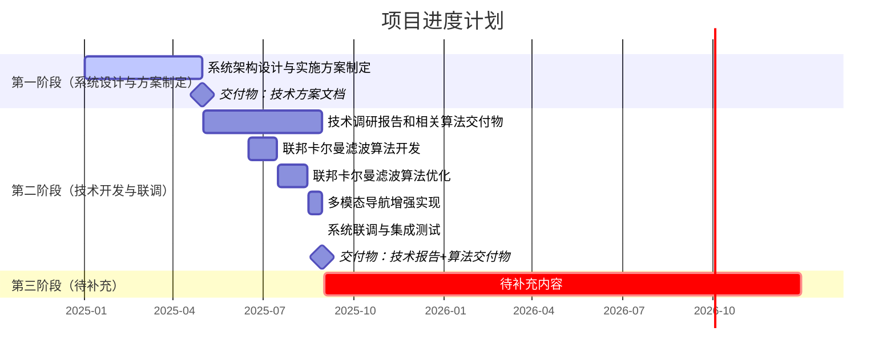

# study
 hhh

```mermaid

gantt

    title 项目进度计划

    dateFormat  YYYY-MM-DD

    axisFormat  %Y-%m

    section 第一阶段（系统设计与方案制定）

    系统架构设计与实施方案制定 :active, a1, 2025-01-01, 2025-04-30

    交付物：技术方案文档          :milestone, m1, 2025-04-30, 0d

    section 第二阶段（技术开发与联调）

    技术调研报告和相关算法交付物        :a2, 2025-05-01, 2025-08-30

    联邦卡尔曼滤波算法开发        :a3, 2025-06-16, 2025-07-15

    联邦卡尔曼滤波算法优化        :a4, 2025-07-16, 2025-08-15

    多模态导航增强实现            :a5, 2025-08-16, 2025-08-30

    系统联调与集成测试            :a6, after a5, 2025-08-30

    交付物：技术报告+算法交付物    :milestone, m2, 2025-08-30, 0d

    section 第三阶段（待补充）

    待补充内容                   :crit, a7, 2025-09-01, 2026-12-30
```
