# driver

## 驱动分为四个部分

* 头文件
* 驱动模块的入口和出口
* 声明信息
* 功能实现

## 驱动编写步骤

```bash
第一步,包含头文件
#include <linux/init.h>
#include <linux/module.h>
第二步,驱动模块的入口和出口
module_init();
module_exit();
第三步,声明模块拥有开源许可证
MODULE_LICENSE("GPL");
第四步,功能实现
```

## 驱动编译方式

### 编译为ko

#### Makefile写法

```bash
写一个Makefile
    obj-m +=helloworld.o
    KDIR:=/home/topeet/topeet/imx6ull/linux-ims-rel_imx_4.1.15_2.1.0_ga
    PWD?=$(shell pwd)
        
    all:
        make -C $(KDIR) M=$(PWD) modules
调用 make 命令:
-C $(KDIR) 切换到内核源码目录 (KDIR) 进行构建
M=$(PWD) 告诉内核构建系统,模块源码位于当前目录 (PWD)
modules 是构建目标,表示编译出模块文件（通常为.ko文件)
驱动编译成模块,然后命令加载到内核
```

```bash
• 编译驱动需要注意的问题
    ○ 内核源码要先编译通过
    ○ 编译驱动模块用的内核源码要和开发板上运行的内核镜像是一套
    ○ 看一下ubuntu的环境是不是arm
• 设置环境变量
    ○ export ARCH=arm
    ○ export CROSS_COMPLIE=arm-linux-gnueabihf-
• 编译即可看到ko文件
• 加载驱动模块
    ○ insmod helloworld.ko
```

### 编译入内核

```bash
进入make menuconfig图形化界面
 
首先进入到内核源码路径下,(开发经历 要先执行make rockchip_linux_defconfig)输入make menuconfig即可打开
 
make menuconfig图形化界面操作
1.搜索功能
    "/" + 想要搜索的内容
2.配置驱动的状态
    (1)把驱动编译成模块,用M来表示
    (2)把驱动编译到内核中,用*来表示(也可用Y控制选择)
    (3)不编译(N控制选择)
可以使用"空格"按键来配置(2)(3),(1)使用M控制
3.保存退出或不保存退出
4.make menuconfig相关的文件
    Makefile 编译规则
    Kconfig menuconfig配置选项
    .config 配置内核后生成的文件
5.make menuconfig读取哪个目录
    $ARCH/目录下的Kconfig 与export ARCH=arm或ARCH=x86有关
    内核源码/arch/arm(arm64)/configs 目录下有好多相关配置文件
6.为什么要复制成.config
    因为内核会默认读取Linux内核根目录下的.config作为默认配置选项,所以不能改名字
7.怎么与Makefile建立联系
    make menuconfig保存退出后,会将所有配置选项以宏定义的形式保存在/include/generated下面的autoconf.h中
8.make menuconfig保存之后执行make savedefconfig
    cp defconfig /arch/arm64/configs/rockchip_linux_defconfig(开发经历)
        ○ 直接把驱动编译到内核
            a.教程举例
            kernel/drivers/Kconfig
                source "drivers/redled/Kconfig"
            kernel/drivers/Makefile
                obj-$(CONFIG_REDLED) += redled/
            kernel/drivers/redled/Kconfig
                config LED_4412
                    tristate "Led Support for GPIO Led"
                    depends on LEDS_CLASS
                    help
                    This option enable support for led
            kernel/drivers/redled/Makefile
                obj-$(CONFIG_REDLED) += redled.o
             
            b.自己开发经历
                kernel/drivers/pcie_dma/Makefile
                obj-$(CONFIG_PCIE_DMA) += pcie_dma_driver.o
                
                kernel/drivers/pcie_dma/Kconfig
                menuconfig PCIE_DMA
                    tristate "PCIE DMA Driver"
                    default n
                    help
                    This is a custom driver for specific hardware.
                
                kernel/drivers/Kconfig
                source "drivers/pcie_dma/Kconfig"
                
                kernel/drivers/Makefile
                obj-$(CONFIG_PCIE_DMA) += pcie_dma/
```

## app.c CMakeLists.txt

```bash
cmake_minimum_required(VERSION 3.10)

project(PCIE_FPGA VERSION 1.0 LANGUAGES C)

# set C compile standard
set(CMAKE_C_STANDARD 11)
set(CMAKE_C_STANDARD_REQUIRED True)

# 设置交叉编译的目标系统和处理器架构
set(CMAKE_SYSTEM_NAME Linux)         # 目标系统为 Linux
set(CMAKE_SYSTEM_PROCESSOR aarch64)  # 目标处理器为 ARM 64 位

# 指定交叉编译工具链路径
set(TOOLCHAIN_DIR /home/tronlong/rk3568/rk3/rk356x_linux_release_v1.3.1_20221120/prebuilts/gcc/linux-x86/aarch64/gcc-arm-10.3-2021.07-x86_64-aarch64-none-linux-gnu)

# 设置交叉编译工具
set(CMAKE_C_COMPILER ${TOOLCHAIN_DIR}/bin/aarch64-none-linux-gnu-gcc)
set(CMAKE_CXX_COMPILER ${TOOLCHAIN_DIR}/bin/aarch64-none-linux-gnu-g++)
set(CMAKE_ASM_COMPILER ${TOOLCHAIN_DIR}/bin/aarch64-none-linux-gnu-as)
set(CMAKE_AR ${TOOLCHAIN_DIR}/bin/aarch64-none-linux-gnu-ar)
set(CMAKE_RANLIB ${TOOLCHAIN_DIR}/bin/aarch64-none-linux-gnu-ranlib)

execute_process(
    COMMAND pwd
    OUTPUT_VARIABLE PROJECT_SOURCE_DIR
    OUTPUT_STRIP_TRAILING_WHITESPACE
)
# set header file path
include_directories(${PROJECT_SOURCE_DIR}/../include)
set(SOURCES src/my_dma_include.c)

# add exe.c
add_executable(my_dma_test ${PROJECT_SOURCE_DIR}/../test/my_dma_test.c ${SOURCES})

cmake_minimum_required(VERSION 3.10)

project(PCIE_FPGA VERSION 1.0 LANGUAGES C)

# set C compile standard
set(CMAKE_C_STANDARD 11)
set(CMAKE_C_STANDARD_REQUIRED True)

# 设置交叉编译的目标系统和处理器架构
set(CMAKE_SYSTEM_NAME Linux)         # 目标系统为 Linux
set(CMAKE_SYSTEM_PROCESSOR aarch64)  # 目标处理器为 ARM 64 位

# 指定交叉编译工具链路径
set(TOOLCHAIN_DIR /home/tronlong/rk3568/rk3/rk356x_linux_release_v1.3.1_20221120/prebuilts/gcc/linux-x86/aarch64/gcc-arm-10.3-2021.07-x86_64-aarch64-none-linux-gnu)

# 设置交叉编译工具
set(CMAKE_C_COMPILER ${TOOLCHAIN_DIR}/bin/aarch64-none-linux-gnu-gcc)
set(CMAKE_CXX_COMPILER ${TOOLCHAIN_DIR}/bin/aarch64-none-linux-gnu-g++)
set(CMAKE_ASM_COMPILER ${TOOLCHAIN_DIR}/bin/aarch64-none-linux-gnu-as)
set(CMAKE_AR ${TOOLCHAIN_DIR}/bin/aarch64-none-linux-gnu-ar)
set(CMAKE_RANLIB ${TOOLCHAIN_DIR}/bin/aarch64-none-linux-gnu-ranlib)

execute_process(
    COMMAND pwd
    OUTPUT_VARIABLE PROJECT_SOURCE_DIR
    OUTPUT_STRIP_TRAILING_WHITESPACE
)
# set header file path
include_directories(${PROJECT_SOURCE_DIR}/../include)
set(SOURCES src/my_dma_include.c)

# add exe.c
add_executable(my_dma_test ${PROJECT_SOURCE_DIR}/../test/my_dma_test.c ${SOURCES})

```

## driver.c Makefile

```bash
ifneq ($(KERNELRELEASE),)
obj-m := pcie_dma_driver.o
else

KDIR=/home/tronlong/rk3568/rk3/rk356x_linux_release_v1.3.1_20221120/kernel
CROSS_COMPILE=/home/tronlong/rk3568/rk3/rk356x_linux_release_v1.3.1_20221120/prebuilts/gcc/linux-x86/aarch64/gcc-arm-10.3-2021.07-x86_64-aarch64-none-linux-gnu/bin/aarch64-none-linux-gnu-

all:
	make -C $(KDIR) M=$(PWD) modules ARCH=arm64 CROSS_COMPILE=$(CROSS_COMPILE)

clean:
	rm -rf *.ko *.o *.mod.o *.mod.c *.symvers  modul* .dma_memcpy.* .pcie_dma_memcpy.* .tmp_versions .*.*.cmd

help:
	@echo "make KDIR=<you kernel path> CROSS_COMPILE=<your CROSS_COMPILE>"
endif


```

## Linux三大设备驱动

```bash
字符设备:IO的传输过程是以字符为单位的,没有缓冲。比如I2C,SPI
块设备:IO的传输是以块为单位的。跟存储相关的都属于块设备,比如tf卡
网络设备:以socket套接字来访问
```

### 杂项设备驱动

```bash
是字符设备的一种。可以自动生成设备节点。
可以输入cat /proc/misc命令来查看
杂项设备的主设备号相同,均为10,次设备号不同。主设备号相同可以节约内核资源
主设备在Linux系统里面是唯一的,此设备不一定唯一。
设备号是计算机是被设备的一种方式,主设备相同的视为同一类设备。
可以通过cat /proc/devices来查看主设备号
• 杂项设备的描述
    定义在内核源码路径
    vi include/linux/miscdevice.h
    struct miscdevice  {
        int minor;//次设备号
        const char *name;//设备节点的名字
        const struct file_operations *fops;//文件操作集
        struct list_head list;
        struct device *parent;
        struct device *this_device;
        const struct attribute_group **groups;
        const char *nodename;
        umode_t mode;
    };
file_operations文件操作定义在 vi include/linux/fs.h下面
```

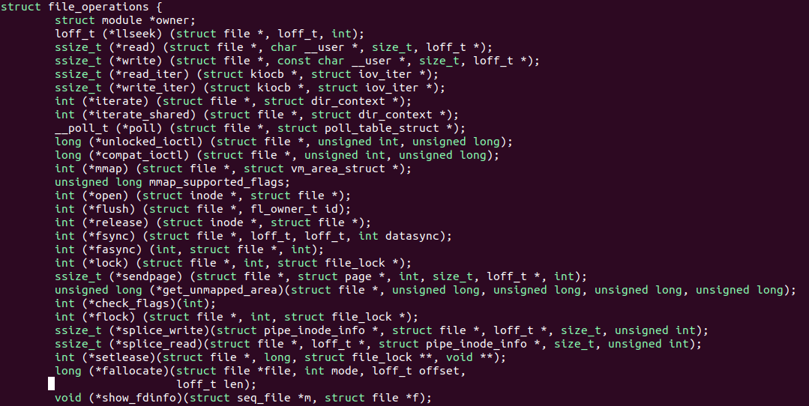

```bash
里面的一个结构体成员都对应一个调用
extern int misc_register(struct miscdevice *misc);
注册杂项设备
extern int misc_deregister(struct miscdevice *misc);
注销杂项设备
```

### 注册杂项设备的流程

```bash
(1)填充miscdevice 这个结构体
(2)填充file operations 这个结构体
(3)注册杂项设备并生生成设备节点
```

#### driver.c

```bash

#include <linux/init.h>
#include <linux/module.h>
#include <linux/miscdevice.h>
#include <linux/fs.h>
 
struct file_operations misc_fops = {
    .owner = THIS_MODULE
};
 
struct misdevice misc_dev = {
    .minor = MISC_DYNAMIC_MINOR,
    .name = "hello_misc",
    .fops = &misc_fops
};
 
static int misc_init(void){
    int ret;
    ret = misc_register(&misc_dev);
    if(ret < 0)
    {
        printk("misc register error\n");
        return -1;
    }
    printk("misc register success\n");
    return 0;
}
 
static void misc_exit(void)
{
    misc_deregister(&misc_dev);
    printk("misc exit");
}
 
module_init(misc_init);
module_exit(misc_exit);
 
MODULE_LICENSE("GPL");
```

## 设备节点对应的操作有打开、关闭、读写

```bash
当我们在应用程序read设备节点的时候,会触发驱动里面的read函数
ssize_t(*read)(struct file *,char _user *,size_t, loff_t *);
当我们在应用程序write设备节点的时候,会触发驱动里面的write函数
ssize_t(*write)(struct file *,const char _user *,size_t, loff_t *);
当我们在应用程序poll/select设备节点的时候,会触发驱动里面的poll函数
unsigned int (*poll) (struct file *, struct poll_table_struct *);
当我们在应用程序ioctl设备节点的时候,会触发驱动里面的unlocked_ioctl函数
long (*unlocked ioctl) (struct file *, unsigned int, unsigned long);
当我们在应用程序open设备节点的时候,会触发驱动里面的open函数
int (*open)(struct inode *,strcut file *);
当我们在应用程序close设备节点的时候,会触发驱动里面的release函数
int (*release)(struct inode *,struct file *);
 
上层应用   设备节点   底层驱动
设备节点是连接上层应用和底层驱动的桥梁
 
int misc_open(struct inode * inode,struct file *file)
{
    printk("hello misc_open\n");
    return 0;
}
 
int misc_release(struct inode * inode,struct file *file)
{
    printk("hello misc_release\n");
    return 0;
}
 
int misc_read(struct file * file,char __user *ubuf,size_t size,loff_t *loff_t)
{
    printk("hello misc_read\n");
    return 0;
}
 
int misc_write(struct file * file,const char __user *ubuf,size_t size,loff_t *loff_t)
{
    printk("hello misc_write\n");
    return 0;
}
 
 
struct file_operations misc_fops = {
    .owner = THIS_MODULE,
    .open = misc_open,
    .release = misc_release,
    .read = misc_read,
    .write = misc_write
};
 
假如file_operations里面没有read,在应用层调用时:什么都不会发生也不会报错
应用层和驱动层是不能直接进行数据传输的
static inline long copy_from_user(void *to,const void __user *from.unsigned long n)
 
static inline long copy_to_user(void __user *to,const void *from.unsigned long n)
```

### linux中要想操作硬件

```bash
需要先把物理地址转换为虚拟地址,因为Linux使能了MMU,所以不能直接操作物理地址
使能MMU好处:(1)让虚拟地址成为了可能
(2)可以让系统更加安全,上层应用看到的内存都是虚拟内存
```

### 内核提供的相关函数

```bash
ioremap:把物理地址转换为虚拟地址
iounmap:释放ioremap映射的地址
 
static inline void _iomem *ioremap(phys_adde_t offset,size_t size)
 
参数:phys_adde_t offset:映射物理地址的起始地址   size_t size:映射多大内存空间
返回值:成功返回虚拟地址的首地址,失败返回NULL

static inline void iounmap(void _iomem *addr)
 
参数:*addr:要取消映射的虚拟地址的首地址
 
注意:物理地址只能被映射一次,多次映射会失败
 
cat /proc/iomem可以查看已经被映射的物理地址

```

#### driver.c

```bash
#include <linux/init.h>
#include <linux/module.h>
#include <linux/miscdevice.h>
#include <linux/fs.h>
#include <linux/uaccess.h>
#include <linux/io.h>

#define GPIO5_DR 0x020AC000 //查看数据手册可得
unsigned int *vir_gpio_addr;

int misc_open(struct inode * inode,struct file *file)
{
    printk("hello misc_open\n");
    return 0;
}
 
int misc_release(struct inode * inode,struct file *file)
{
    printk("hello misc_release\n");
    return 0;
}
 
int misc_read(struct file * file,char __user *ubuf,size_t size,loff_t *loff_t)
{
    printk("hello misc_read\n");
    return 0;
}

int misc_write(struct file * file,const char __user *ubuf,size_t size,loff_t *loff_t)
{
    char kbuf[64] = {0};
    if(copy_from_user(kbuf,ubuf,size)!= 0)
    {
        printk("copy_from_user error\n");
        return -1;
    }
    printk("kbuf  is %s\n",kbuf);
    if(kbuf[0] == 1)
        *vir_gpio_addr |= (1<<1);
    else if(kbuf[0] == 0)
        *vir_gpio_addr &= ~(1<<1);
        
    return 0;
}

struct file_operations misc_fops = {
    .owner = THIS_MODULE,
    .open = misc_open,
    .release = misc_release,
    .read = misc_read,
    .write = misc_write
};

struct misdevice misc_dev = {
    .minor = MISC_DYNAMIC_MINOR,
    .name = "hello_misc",
    .fops = &misc_fops
};

static int misc_init(void){
    int ret;
    ret = misc_register(&misc_dev);
    if(ret < 0)
    {
        printk("misc register error\n");
        return -1;
    }
    printk("misc register success\n");
    
    vir_gpio_addr = ioremap(GPIO5_DR,4);//4字节
    
    if(vir_gpio_addr == NULL)
    {
        printk("GPIO5_DR ioremap failed\n");
        return -EBUSY;
    }
    printk("GPIO5_DR ioremap success\n");
    
    return 0;
}

static void misc_exit(void)
{
    misc_deregister(&misc_dev);
    iounmap(vir_gpio_addr);
    printk("misc exit");
}

module_init(misc_init);
module_exit(misc_exit);
 
MODULE_LICENSE("GPL");
```

#### app.c

```bash
#include <stdio.h>
#include <sys/types.h>
#include <sus/stat.h>
#include <fcntl.h>
#include <unistd.h>

int main(int argc,char *argv[])
{
    int fd;
    char buf[64] = {0};
    fd = open("/dev/hello_misc",O_RDWR);
    if(fd < 0)
    {
        perror("open error\n");
        return -1;
    }
    buf[0] = atoi(argv[1]);
    //read(fd,buf,sizeof(buf));
    write(fd,buf,sizeof(buf));
    //printf("buf is %s\n",buf);
    close(fd);
    return 0;
}
```

### 驱动传参

```bash
insmod beep.ko a=1
驱动传参数有什么作用
(1)设置驱动的相关参数,比如设置缓冲区的大小
(2)设置安全校验,防止写的驱动被盗用

传递参数类型
(1)传递普通的参数,比如char,int类型
函数:module_param(name,type,perm);
参数:name 要传递进去的参数的名称
type 类型
perm 参数读写的权限
(2)传递数组
函数:module_param_array(name,type,nump,perm);
参数:name 要传递进去的参数的名称
type 类型
nump 实际传入进去的参数的个数
perm 参数读写的权限
```

#### 驱动传参示例driver.c

```bash
static int a;
static int b[5];
static int cnt;

module_param(a,int,S_IRUSR); 
module_param(b,int,&cnt,S_IRUSR); 

static int misc_init(void){
    int i;
    for(i = 0; i<  cnt; i++)
    {
        printk("b[%d] = %d\n",i,b[i]);
    }
    printk("cnt = %d\n",cnt);
    printk("a = %d",a);
    return 0;
}

static void misc_exit(void)
{
    printk("a = %d",a);
    printk("misc exit");
}

```

#### 驱动传参测试

```bash
insmod parameter.ko a=2(parameter.ko在Makefile文件中定义,或与文件名相同)
cd /sys/module/parameter
ls
可以看到目录下有一个a
ls -l
查看权限为-r----- 与00400相同
-rwxr-xr-x  1 user group 4096 Dec 30 12:34 filename
    r 表示读取权限（read）= 4
    w 表示写入权限（write）= 2
    x 表示执行权限（execute）= 1
前三个字符代表文件所有者(user)的权限,中间三个字符代表所属组(group)的权限,后三个字符表示其他用户(others)的权限
insmod parameter.ko b=1,2,3,4,5
b[0] = 1
b[1] = 2
b[2] = 3
b[3] = 4
b[4] = 5
cnt = 5
a = 0
cd /sys/module/parameter
ls
可以看到目录下有a b
如果传入6个参数
```

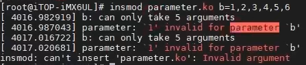

```bash
操作失败
```

## 申请字符类设备号

```bash
杂项设备和字符设备的区别
杂项设备的主设备号是固定的,固定为10。字符类设备需要自己或者系统分配设备号
杂项设备可以自动生成设备节点,字符设备需要自己生成设备节点
```

### 注册字符类设备的方法

```bash
1.静态分配设备号include/linux/fs.h
register_chrdev_region(dev_t,unsigned,const char*);
需要明确知道系统里面哪些设备号没有用
参数
一:设备号的起始值。类型是dev_t类型
二:次设备号的个数
三:设备的名称
返回值:成功返回0,失败返回非0

dev_t类型
用来保存设备号的,32位。在include/linux/types.h中 typedef __u32 __kernel_dev_t; typedef __kernel_dev_t dev_t;
高12位是用来保存主设备号,低12位用来保存次设备号
在include/linux/types.h中,linux提供了几个宏定义来操作设备号
#define MINORBITS       20
此设备号的位数,一共20位
#define MINORMASK    ((1U<<MINORBITS) - 1)
次设备号的掩码
#define MAJOR(dev)       ((unsigned int)((dev)>>MINORBITS))
在dev_t里面获取主设备号
#define MINOR(dev)       ((unsigned int)((dev)&MINORMASK))
在dev_t里面获取次设备号
#define MKDEV(ma,mi) (((ma)<<MINORBITS | (mi))
将我们的主设备号和次设备号组成一个dev_t 类型,第一个参数是主设备号,第二个参数是次设备号

2.动态分配
alloc_chredv_region(dev_t *,unsigned ,unsigned,const char *);
参数:
第一个:保存生成的设备号
第二个:申请的第一个次设备号,通常是0；
第三个:连续申请的设备号个数
第四个:设备名称
返回值:成功返回0,失败返回非0
使用动态分配会优先使用255到234

3.注销设备号
unregister_chrdev_region(dev_t,unsigned);
第一个参数:分配设备号的起始地址
第二个参数:申请的连续设备号的个数  

misc_register(&misc_dev);
注册杂项设备
misc_deregister(&misc_dev);
注销杂项设备
```

#### driver.c

```bash
#include <linux/init.h>
#include <linux/module.h>
#include <linux/fs.h>
#include <linux/kdev_t.h>

#define DEVICE_NUM 1
#define DEVICE_SNAME "staticdev"
#define DEVICE_ANAME "activatedev"
#define DEVICE_MINORNUM 0
static int major_num,minor_num;

module_param(major_num,int,S_IRUSR); 
module_param(minor_num,int,S_IRUSR); 

static int misc_init(void){
    dev_t dev_num;
    int ret;
    if(major_num)
    {
        printk("major_num = %d\n",major_num);
        printk("minor_num = %d\n",minor_num);
        dev_num = MKDEV(major_num,minor_num);
        ret = register_chrdev_region(dev_num,DEVICE_NUM,DEVICE_SNAME);
        if(ret < 0){
            printk("register error\n");
        }
        printk("register ok\n");
        
    }else{
    
        ret = alloc_chredv_region(&dev_num,DEVICE_MINORNUM,DEVICE_NUM,DEVICE_ANAME);
        if(ret < 0){
            printk("alloc register error\n");
        }
        printk("alloc register ok\n");
        
        major_num = MAJOR(dev_num);
        minor_num = MINOR(dev_num);
        
        printk("major_num = %d\n",major_num);
        printk("minor_num = %d\n",minor_num);
        
    }
    return 0;
}

static void misc_exit(void)
{
    unregister_chrdev_region(MKDEV(major_num,minor_num),DEVICE_NUM);
    printk("misc exit");
}

module_init(misc_init);
module_exit(misc_exit);
MODULE_LICENSE("GPL");
```

#### 驱动测试示例

```bash
cat /proc/devices查看已经分配的设备号

insmod chrdev.ko major_num=9
看到打印major_num和minor_num和register ok

insmod chrdev.ko
看到alloc register ok和major_num,minor_num
```

### cdev结构体

```bash
描述字符设备的一个结构体
include\linux\cdev.h

struct cdev {
    struct kobject kobj;
    struct module *owner;
    const struct file_operations *ops;
    struct list_head list;
    dev_t dev;
    unsigned int count;
} __randomize_layout;

步骤一:定义一个cdev结构体

步骤二:使用cdev_init函数初始化cdev结构体成员变量
void cdev_init(struct cdev *, const struct file_operations *);
参数:
第一个:要初始化的dev
第二个:文件操作集
cdev->ops = fops;//实际就是把文件操作集写个ops

步骤三:使用cdev_add函数注册到内核
int cdev_add(struct cdev *, dev_t, unsigned);
参数:
第一个参数:cdev的结构体指针
第二个参数:设备号
第三个参数:次设备号的数量

步骤四:注销字符设备
void cdev_del(struct cdev *);
```

#### driver.c

```bash
#include <linux/init.h>
#include <linux/module.h>
#include <linux/fs.h>
#include <linux/kdev_t.h>
#include <linux/cdev.h>

#define DEVICE_NUM 1
#define DEVICE_SNAME "staticdev"
#define DEVICE_ANAME "activatedev"
#define DEVICE_MINORNUM 0

static int major_num,minor_num;

module_param(major_num,int,S_IRUSR); 
module_param(minor_num,int,S_IRUSR);

struct cdev cdev;

struct file_operation chrdev_ops = {
    .owner = THIS_MUDULE,
    .open = chrdev_open
};

int chrdev_open(struct inode * inode,struct file *file)
{
    printk("cdev open\n");
    return 0;
}

static int cdev_init(void){
    dev_t dev_num;
    int ret;
    if(major_num)
    {
        printk("major_num = %d\n",major_num);
        printk("minor_num = %d\n",minor_num);
        dev_num = MKDEV(major_num,minor_num);
        ret = register_chrdev_region(dev_num,DEVICE_NUM,DEVICE_SNAME);
        if(ret < 0){
            printk("register error\n");
        }
        printk("register ok\n");
        
    }else{
    
        ret = alloc_chredv_region(&dev_num,DEVICE_MINORNUM,DEVICE_NUM,DEVICE_ANAME);
        if(ret < 0){
            printk("alloc register error\n");
        }
        printk("alloc register ok\n");
        
        major_num = MAJOR(dev_num);
        minor_num = MINOR(dev_num);
        
        printk("major_num = %d\n",major_num);
        printk("minor_num = %d\n",minor_num);
        
    }
    cdev.owner = THIS_MODULE;
    cdev_init(&cdev,&chrdev_open);
    cdev_add(&cdev,dev_num,DEVICE_NUM);
    return 0;
}

static int cdev_exit(void)
{
    unregister_chrdev_region(MKDEV(major_num,minor_num),DEVICE_NUM);
    cdev_del(&cdev);
    printk("cdev exit\n");
}

module_init(cdev_init);
module_exit(cdev_exit);
MODULE_LICENSE("GPL");
```

#### app.c

```bash
#include <stdio.h>
#include <sys/types.h>
#include <sus/stat.h>
#include <fcntl.h>
#include <unistd.h>

int main(int argc,char *argv[])
{
    int fd;
    fd = open("/dev/test",O_RDWR);
    if(fd < 0)
    {
        perror("open error\n");
        return -1;
    }
    return 0;
}
```

### 加载ko

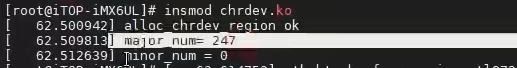

### 手动添加设备节点

```bash
字符设备注册完以后不会自动生成设备节点
需要使用mknod命令创建一个设备节点
example:
mknod name type master_num minor_num
mknod /dev/test c 247 0

即可在/dev目录下创建test设备
```

### 自动创建设备节点

```bash
在嵌入式Linux中使用mdev来实现设备节点文件的自动创建和删除

mdev是udev的简化版本时busybox中所带的程序,最适合用在嵌入式系统中

udev是一种工具,它能够根据系统中的硬件设备的状态动态更新设备文件,包括设备文
件的创建,删除等。设备文件通常放在/dev目录下。使用udev后,在/dev目录下就只包
含系统中真正存在的设备。udev一般用在PC上的linux中,相对mdev来说要复杂些。
```

### 如何创建设备节点

```bash
步骤一:使用class_create函数创建一个class类
步骤二:使用device_create函数在创建的类下面创建一个设备
```

### 创建和删除类函数

```bash
class结构体定义在include/linux/device.h里面

class_create是类创建函数
定义如下:
#define class_create(owner,name)\
({\
static struct lock_class_key_key;\
_class_create(owner,name,&_key);\
})
struct class *_class_create(struct module *owner,const char *name,struct lock_class_key *key)
一共两个参数
参数一:owner一般为THIS_MODULE
参数二:name是类名字
返回值为指向结构体class的指针,也就是创建的类

类删除函数
class_destroy(struct class *cls)
cls即要删除的类
```

#### driver.c

```bash
#include <linux/init.h>
#include <linux/module.h>
#include <linux/fs.h>
#include <linux/kdev_t.h>
#include <linux/cdev.h>
#include <linux/device.h>

#define DEVICE_NUM 1
#define DEVICE_SNAME "staticdev"
#define DEVICE_ANAME "activatedev"
#define DEVICE_MINORNUM 0
#define DEVICE_CLASS_NAME "chrdev_class"
#define DEVICE_NODE_NAME "chrdev_test"

static int major_num,minor_num;

module_param(major_num,int,S_IRUSR); 
module_param(minor_num,int,S_IRUSR);

struct cdev cdev;
struct class *class;
struct device *device;
dev_t dev_num;

struct file_operation chrdev_ops = {
    .owner = THIS_MUDULE,
    .open = chrdev_open
};

int chrdev_open(struct inode * inode,struct file *file)
{
    printk("chrdev open\n");
    return 0;
}

static int cdev_init(void){
    int ret;
    if(major_num)
    {
        printk("major_num = %d\n",major_num);
        printk("minor_num = %d\n",minor_num);
        dev_num = MKDEV(major_num,minor_num);
        ret = register_chrdev_region(dev_num,DEVICE_NUM,DEVICE_SNAME);
        if(ret < 0){
            printk("register error\n");
        }
        printk("register ok\n");
        
    }else{
    
        ret = alloc_chredv_region(&dev_num,DEVICE_MINORNUM,DEVICE_NUM,DEVICE_ANAME);
        if(ret < 0){
            printk("alloc register error\n");
        }
        printk("alloc register ok\n");
        
        major_num = MAJOR(dev_num);
        minor_num = MINOR(dev_num);
        
        printk("major_num = %d\n",major_num);
        printk("minor_num = %d\n",minor_num);
        
    }
    cdev.owner = THIS_MODULE;

    cdev_init(&cdev,&chrdev_open);

    cdev_add(&cdev,dev_num,DEVICE_NUM);

    class = class_create(THIS_MODULE,DEVICE_CLASS_NAME);

    device = device_create(class,NULL,dev_num,NULL,DEVICE_NODE_NAME);
    return 0;
}

static int cdev_exit(void)
{
    unregister_chrdev_region(MKDEV(major_num,minor_num),DEVICE_NUM);
    cdev_del(&cdev);
    device_destroy(class,dev_num);
    class_destroy(class);
    printk("cdev exit\n");
}

module_init(cdev_init);
module_exit(cdev_exit);
MODULE_LICENSE("GPL");
```

#### 插入ko后

```bash
insmod chrdev.ko
在/sys/class下生成chrdev_class类
```

### 创建设备函数

```bash
使用上节的函数创建完成一个类之后,使用device_create函数在这个类下创建一个设备

device_create函数原型如下
struct device *device_create(struct class *class,\
    struct device *parent,dev_t devt,void *drvdata,const char *fmt,...)
该函数是个可变参数函数
class:就是设备要创建在哪个类下面
parent:父设备,一般为NULL
devt:设备号
drvdata:设备可能会使用的一些数据,一般为NULL
fmt:设备名字,如果设置fmt=xxx的话,就会生成/dev/xxx这个设备文件
返回值就是创建好的设备
```

#### 插入ko后

```bash
在/dev/目录下生成chrdev_test设备
在/sys/class下生成chrdev_class类
```

### 删除创建的设备

```bash
void device_destroy(struct class *class,dev_t devt)
class:要删除的设备所处的类
devt:要删除的设备号

rmmod chrdev.ko
打印输出信息并且/sys/class目录下没有chrdev_class,/dev目录下没有chrdev_test
```

#### app.c

```bash
#include <stdio.h>
#include <sys/types.h>
#include <sus/stat.h>
#include <fcntl.h>
#include <unistd.h>

int main(int argc,char *argv[])
{
    int fd;
    fd = open("/dev/chrdev_test",O_RDWR);
    if(fd < 0)
    {
        perror("open error\n");
        return -1;
    }
    return 0;
}
```

## 杂项设备驱动框架

```bash
注册杂项设备
misc_register(&misc)
构建杂项设备结构体
struct misdevice misc_dev = {
    .minor = MISC_DYNAMIC_MINOR,
    .name = "hello_misc",
    .fops = &misc_fops
};
构建file_operations
struct file_operations misc_fops = {
    .owner = THIS_MODULE,
    .open = misc_open,
    .release = misc_release,
    .read = misc_read,
    .write = misc_write
};
卸载杂项设备
misc_deregister(&misc)
```

## 字符设备驱动框架

```bash
驱动初始化
* 分配设备号
    * 静态分配 register_chrdev_region
    * 动态分配 alloc_chrdev_region
    * 操作设备号dev_t 
        * MAJOR用于从dev_t获取主设备号
        * MINOR用于从dev_t获取次设备号
        * MKDEV用于将给定的主设备号和次设备号值组合成dev_t类型的设备号
* 初始化cdev
    * cdev_init
* 注册cdev
    * cdev_add
* 初始化硬件
构建file_operations
struct file_operations misc_fops = {
    .owner = THIS_MODULE,
    .open = misc_open,
    .release = misc_release,
    .read = misc_read,
    .write = misc_write
};
生成设备节点
* 自动生成设备节点
    * 创建一个class class_create
    * 创建一个设备 device_create
* 手动生成设备节点
    * mknod命令
驱动卸载
* 释放设备号 unregister_chrdev_region
* 卸载cdev cdev_del
* 卸载设备 device_destroy
* 卸载class class_destroy
```

## 应用层打开设备节点

```bash
struct file_operations misc_fops = {
    .owner = THIS_MODULE,
    .open = misc_open,
    .release = misc_release,
    .read = misc_read,
    .write = misc_write
};
使用fd=open("/dev/xxx",O_RDWR)
read(fd,data,1)
write(fd,data,1)
来操作上面的open,read,write函数
```

## 平台总线模型

```bash
平台总线模型也叫platform总线模型。是Linux内核虚拟出来的一条总线,不是真实的导线。
平台总线模型就是把原来的驱动C文件分成了两个文件,一个是device.c,一个是driver.c
把稳定不变的放在driver.c里面,需要变更的放在device.c里面

可以减少代码的重用性
减少重复性代码

设备---总线---驱动
device.c  driver.c

编写的过程是分别注册device.c和driver.c
平台总线是以名字来匹配的,也就是字符串比较
```

### 注册设备device

```bash
device.c中写的是硬件资源,包括寄存器地址,中断号,时钟等硬件资源
在Linux内核里面,是用一个结构体来描述硬件资源的。

kernel/include/linux/platform_device.h
struct platform_device 
{
    const char *name; # 平台总线进行匹配的时候用到的name,在/sys/bus/platform/devices路径下生成对应文件
    int id; # 设备id,一般写-1
    struct device dev; # 内嵌的device结构体
    u32 num_resources; # 资源的个数
    struct resource *resource; # device中的硬件资源
};

kernel/include/linux/ioport.h
struct resource {
    resource_size_t start; # 资源的起始
    resource_size_t end; # 资源的结束
    const char *name; # 资源的名字
    unsigned long flags; # 资源的类型
};

#define IORESOURCE_IO  IO的内存
#define IORESOURCE_MEM 常用表述一段物理内存
#define IORESOURCE_IRQ 表示中断

```

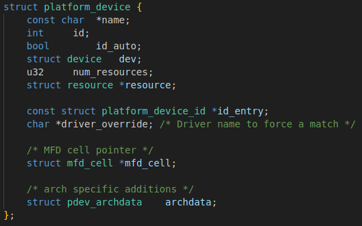
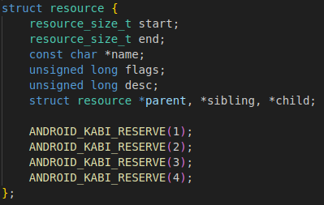
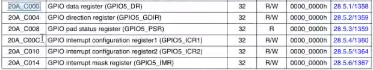

#### device.c

```bash
#include <linux/init.h>
#include <linux/module.h>
#include <linux/platform_device.h>
#include <linux/ioport.h>

void beep_release(struct device *dev)
{
    printk("beep release\n");
}

struct resource beep_res[] = 
{
    [0] = {
        .start = 0x20AC000,
        .end   = 0x20AC003,
        .flags = IORESOURCE_MEM,
        .name  = "GPIO5_DR"
    }
};

struct platform_device beep_device = {
    .name = "beep_test",
    .id = -1,
    .resource = beep_res,
    .num_resources = ARRAY_SIZE(beep_res),
    .dev = {
        .release = beep_release
    }
};

static int device_init(void)
{
    printk("device hello\n");
    return platform_device_register(&beep_device);
}

static void device_exit(void)
{
    printk("device exit\n");
    platform_device_unregister(&beep_device);
}

module_init(device_init);
module_exit(device_exit);

MODULE_LICENSE("GPL");
```

### 注册驱动driver

```bash
首先定义一个platform_driver结构体变量,然后去实现结构体中的各个成员变量,
那么当driver和device匹配成功的时候,就会执行probe函数.重点在于probe函数的编写

struct platform_driver {
    int (*probe)(struct platform_device *); # 当driver和device匹配成功的时候,就会执行
    int (*remove)(struct platform_device *); # 当driver和device任意一个remove的时候,就会执行
    void (*shutdown)(struct platform_device *); # 当设备收到shutdown命令的时候,就会执行
    int (*suspend)(struct platform_device *, pm_message_t state); # 当设备收到suspend....
    int (*resume)(struct platform_device *); # 当设备收到resume....
    struct device_driver driver;
    const struct platform_device_id *id_table; # driver和id_table都有name成员,优先匹配id_table
};

struct device_driver {
    const char *name; # 匹配设备用到的
    struct module *owner;
};
```

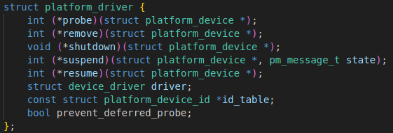
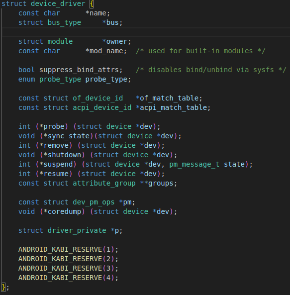

#### driver.c

```bash
#include <linux/init.h>
#include <linux/module.h>
#include <linux/platform_device.h>

int beep_probe(struct platform_device *pdev)
{
    printk("beep probe\n");
    return 0;
}

int beep_remove(struct platform_device *pdev)
{
    printk("beep remove\n");
    return 0;
}

const struct platform_device_id beep_idtable = {
    .name = "123" //这样是匹配不成功的,需要和device中name一致
    // .name = "beep_test" #这样是可以匹配成功的
};

struct platform_driver beep_driver = {
    .probe = beep_probe,
    .remove = beep_remove,
    .driver = {
        .owner = THIS_MODULE,
        .name = "beep_test",
        // .name = "123"
    },
    .id_table = &beep_idtable
};

static int beep_driver_init(void)
{
    int ret = 0;

    ret = platform_driver_register(&beep_driver);
    if(ret < 0){
        printk("platform_driver_register error\n");
    }
    return 0;
}

static void beep_driver_exit(void)
{
    printk("device exit\n");
    platform_driver_unregister(&beep_driver);
}

module_init(beep_driver_init);
module_exit(beep_driver_exit);

MODULE_LICENSE("GPL");
```

### 平台总线probe函数

#### 编写思路

```bash
* 从device.c里面获取硬件资源
    * 方法一:driver.c中直接获取,不推荐
    * 方法二:driver.c中通过函数获取
    extern struct resource *platform_get_resource(struct platform_device *,
                            unsigned int, unsigned int);
                            资源类型       资源存储在哪个位置上
* 注册杂项/字符设备,完善file_operation结构体,并生成设备节点
    * 注册前要先申请 request_mem_region(start,length,name)
```

#### device.c

```bash
#include <linux/init.h>
#include <linux/module.h>
#include <linux/platform_device.h>
#include <linux/ioport.h>

void beep_release(struct device *dev)
{
    printk("beep release\n");
}

struct resource beep_res[] = 
{
    [0] = {
        .start = 0x20AC000,
        .end   = 0x20AC003,
        .flags = IORESOURCE_MEM,
        .name  = "GPIO5_DR"
    }
};

struct platform_device beep_device = {
    .name = "beep_test",
    .id = -1,
    .resource = beep_res,
    .num_resources = ARRAY_SIZE(beep_res),
    .dev = {
        .release = beep_release
    }
};

static int device_init(void)
{
    printk("device hello\n");
    return platform_device_register(&beep_device);
}

static void device_exit(void)
{
    printk("device exit\n");
    platform_device_unregister(&beep_device);
}

module_init(device_init);
module_exit(device_exit);

MODULE_LICENSE("GPL");
```

#### driver.C

```bash
#include <linux/init.h>
#include <linux/module.h>
#include <linux/platform_device.h>
#include <linux/ioport.h>

struct resource *beep_mem;
struct resource *beep_mem_tmp;

int beep_probe(struct platform_device *pdev)
{
    printk("beep probe\n");
    /*方法一*/
    // printk("beep_res is %s\n",pdev->resource[0].name); 
    /*方法二*/
    beep_mem = platform_get_resource(pdev,IORESOURCE_MEM,0);
    if(beep_mem == NULL)
    {
        printk("platform_get_resource error\n");
        return -EBUSY;
    }
    printk("beep_res start is 0x%x\n",beep_mem->start);
    printk("beep_res start is 0x%x\n",beep_mem->end);

#if
    beep_mem_tmp = request_mem_region(beep_mem->start,beep_mem->end - beep_mem->start + 1, "beep");
    if(beep_mem_tmp == NULL)
    {
        printk("request error\n");
        goto error_region;
    }
#endif
    return 0;
error_region:
    release_mem_region(beep_mem->start,beep_mem->end - beep_mem->start + 1);
    return -EBUSY;
}

int beep_remove(struct platform_device *pdev)
{
    printk("beep remove\n");
    return 0;
}

const struct platform_device_id beep_idtable = {
    .name = "123" //这样是匹配不成功的,需要和device中name一致
    // .name = "beep_test" #这样是可以匹配成功的
};

struct platform_driver beep_driver = {
    .probe = beep_probe,
    .remove = beep_remove,
    .driver = {
        .owner = THIS_MODULE,
        .name = "beep_test"
        // .name = "123"
    },
    .id_table = &beep_idtable
};

static int beep_driver_init(void)
{
    int ret = 0;

    ret = platform_driver_register(&beep_driver);
    if(ret < 0){
        printk("platform_driver_register error\n");
    }
    return 0;
}

static void beep_driver_exit(void)
{
    printk("device exit\n");
    platform_driver_unregister(&beep_driver);
}

module_init(beep_driver_init);
module_exit(beep_driver_exit);

MODULE_LICENSE("GPL");
```

#### 杂项设备举例driver.c(device.ko插入状态进行验证)

```bash
#include <linux/init.h>
#include <linux/module.h>
#include <linux/platform_device.h>
#include <linux/ioport.h>
#include <linux/miscdevice.h>
#include <linux/fs.h>
#include <linux/uaccess.h>
#include <linux/io.h>

struct resource *beep_mem;
struct resource *beep_mem_tmp;

unsigned int *vir_gpio_addr;

int misc_open(struct inode * inode,struct file *file)
{
    printk("hello misc_open\n");
    return 0;
}
 
int misc_release(struct inode * inode,struct file *file)
{
    printk("hello misc_release\n");
    return 0;
}
 
int misc_read(struct file * file,char __user *ubuf,size_t size,loff_t *loff_t)
{
    printk("hello misc_read\n");
    return 0;
}

int misc_write(struct file * file,const char __user *ubuf,size_t size,loff_t *loff_t)
{
    char kbuf[64] = {0};
    if(copy_from_user(kbuf,ubuf,size)!= 0)
    {
        printk("copy_from_user error\n");
        return -1;
    }
    printk("kbuf  is %s\n",kbuf);
    if(kbuf[0] == 1)
        *vir_gpio_addr |= (1<<1);
    else if(kbuf[0] == 0)
        *vir_gpio_addr &= ~(1<<1);

    return 0;
}

struct file_operations misc_fops = {
    .owner = THIS_MODULE,
    .open = misc_open,
    .release = misc_release,
    .read = misc_read,
    .write = misc_write
};

struct misdevice misc_dev = {
    .minor = MISC_DYNAMIC_MINOR,
    .name = "hello_misc",
    .fops = &misc_fops
};

int beep_probe(struct platform_device *pdev)
{
    int ret = 0;
    printk("beep probe\n");
    /*方法一*/
    // printk("beep_res is %s\n",pdev->resource[0].name); 
    /*方法二*/
    beep_mem = platform_get_resource(pdev,IORESOURCE_MEM,0);
    if(beep_mem == NULL)
    {
        printk("platform_get_resource error\n");
        return -EBUSY;
    }
    printk("beep_res start is 0x%x\n",beep_mem->start);
    printk("beep_res start is 0x%x\n",beep_mem->end);

#if
    beep_mem_tmp = request_mem_region(beep_mem->start,beep_mem->end - beep_mem->start + 1, "beep");
    if(beep_mem_tmp == NULL)
    {
        printk("request error\n");
        goto error_region;
    }
#endif
/*******************************************************/
    vir_gpio_addr = ioremap(beep_mem->start,4);//4字节
    
    if(vir_gpio_addr == NULL)
    {
        printk("beep_mem->start ioremap failed\n");
        return -EBUSY;
    }
    printk("beep_mem->start ioremap success\n");
/*******************************************************/
    ret = misc_register(&misc_dev);
    if(ret < 0)
    {
        printk("misc register error\n");
        return -1;
    }
    printk("misc register success\n");
/*******************************************************/
    return 0;
error_region:
    release_mem_region(beep_mem->start,beep_mem->end - beep_mem->start + 1);
    return -EBUSY;
}

int beep_remove(struct platform_device *pdev)
{
    printk("beep remove\n");
    return 0;
}

const struct platform_device_id beep_idtable = {
    .name = "123" //这样是匹配不成功的,需要和device中name一致
    // .name = "beep_test" #这样是可以匹配成功的
};

struct platform_driver beep_driver = {
    .probe = beep_probe,
    .remove = beep_remove,
    .driver = {
        .owner = THIS_MODULE,
        .name = "beep_test"
        # .name = "123"
    },
    .id_table = &beep_idtable
};

static int beep_driver_init(void)
{
    int ret = 0;

    ret = platform_driver_register(&beep_driver);
    if(ret < 0){
        printk("platform_driver_register error\n");
    }
    return 0;
}

static void beep_driver_exit(void)
{
    printk("device exit\n");
    platform_driver_unregister(&beep_driver);
    misc_deregister(&misc_dev);
    iounmap(vir_gpio_addr);
}

module_init(beep_driver_init);
module_exit(beep_driver_exit);

MODULE_LICENSE("GPL");
```

```bash
成功在/dev下会看到hello_misc
```

#### 杂项设备举例app.c

```bash
#include <stdio.h>
#include <sys/types.h>
#include <sus/stat.h>
#include <fcntl.h>
#include <unistd.h>

int main(int argc,char *argv[])
{
    int fd;
    char buf[64] = {0};
    fd = open("/dev/hello_misc",O_RDWR);
    if(fd < 0)
    {
        perror("open error\n");
        return -1;
    }
    buf[0] = atoi(argv[1]);
    
    write(fd,buf,sizeof(buf));
    
    close(fd);
    return 0;
}
```

### 平台总线模型总结

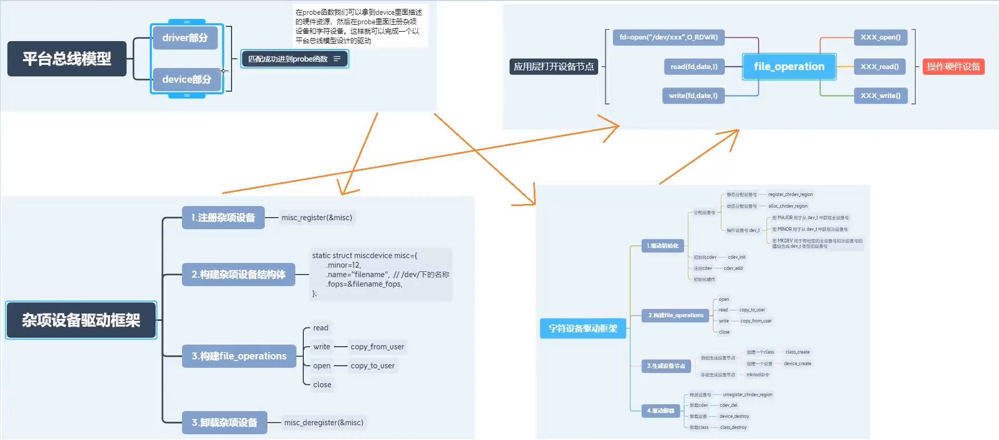

## 设备树

```bash
设备树是一种描述硬件资源的数据结构。通过bootloader将硬件资源传给内核,使得内核和硬件资源描述相对独立

通过内核提供的接口获取设备树的节点和属性,对于同一soc的不同主板,
只需更换设备树文件dtb即可实现不同主板的无差异支持,无需更换内核文件

```

### 基本概念

```bash
语法结构像树一样,所以叫设备树

DT:Device Tree                          //设备树
FDT:Flattened Device Tree               //展开设备树,起源于OF,所以在设备树中可以看到很多of字母的函数
device tree source(dts)                 //设备树代码
device tree source includeDTB(dtsi)     //更通用的设备树代码,相同芯片但不同平台都可以使用的代码
device tree blob(dtb)                   //DTS编译后得到的DTB文件
device tree compiler(dtc)               //设备树编译器
```

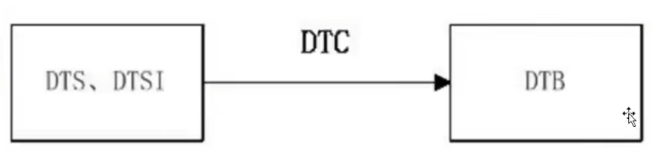

### 基本框架

```bash
设备树从根节点开始,每个设备都是一个节点
节点和节点之间可以互相嵌套,形成父子关系
设备的属性用key-value对(键值对)来描述,每个属性用分号结束
```

#### 修改打印

```bash
echo "6" > /proc/sys/kernel/printk
```

#### 根节点

```bash
/{
};
```

#### 根节点子节点

```bash
/{
    node1 (子节点1)
    {
    };
    node2 (子节点2)
    {
    };
};

/{
    node1 (子节点1)
    {
        child-node1 (子子节点1)
        {
        };
    };
    node2 (子节点2)
    {
        child-node2 (子子节点2)
        {
        };
    };
};
```

#### 节点名称

```bash
格式:<name>[@<address>]
note:
同一级节点只要地址不一样,名字是可以相同的
设备地址是一个可选选项,可以不写。但为了容易区分和理解,一般都写
```

#### 节点别名

```bash
uart8:serial@02288000
其中,uart8就是节点名称的别名,serial@02288000是节点名称
```

#### 节点引用

```bash
&uart8 {
    pinctrl-names = "default";
    pinctrl-0 = <&pinctrl_uart8>;
    status = "okay";
};
&uart8表示引用节点别名为uart8的节点,并往这个节点里面添加以下内容
pinctrl-names = "default";
pinctrl-0 = <&pinctrl_uart8>;
status = "okay";

note:
编译设备树的时候,相同的节点的不同属性会被合并,相同节点的相同属性会被重写,
使用引用可以避免移植者到处找节点。如dts和dtsi里面都有根节点,但最终会合并成一个根节点
```

#### 属性

```bash
* reg
    用来描述一个设备的地址范围
    format:
    reg = <addr length addr2 length2 ...>
    example:
    serial@02288000{
        reg = <101F2000 0x1000>;
    };
    其中101F2000是起始地址,0x1000是长度
* #address-cell #size-cells
    #address-cell用来设置子节点中reg地址的数量
    #size-cells用来设置子节点中reg地址长度的数量
cpu{
    #address-cell = <1>;
    #size-cells = <1>;
    serial@101F2000{
        compatible = "serial";
        reg = <101F2000 0x1000>;
    };
};
也就是说子节点里面的reg属性里的寄存器组的起始地址只有一个,长度也只有一个。即101F2000是起始地址,0x1000是长度
* compatible
是一个字符串列表,可以在代码中进行匹配
exmaple: 
compatible = "led";
* status
status属性的值类型是字符串,常用的值有两个:okay,disable
```

#### 添加自定义节点

```bash
查看已定义节点
* /proc/device-tree目录下有根节点定义的设备及其值
    可以通过cat查看内容
    example:
    cat model
    Freescale i.MX6 ULL 14x14 EVK Board
* 或/sys/firmware/devicetree/base
    同上
* 加入节点格式
    testa:testb{
        #address-cells = <1>;
        #size-cells = <1>;
        compatible = "testc";
        reg = <0x20ac000 0x4>;
        status = "okay";
    };

* 编译设备树文件
    apt-get install device-tree-compiler
    配置环境
    make ARCH=arm CROSS_COMPILE=arm-linux-gnueabihf- dtbs (编译全部设备树文件)
    make ARCH=arm CROSS_COMPILE=arm-linux-gnueabihf- imx6ull-14x14-evk.dts
    编译生成的dtb文件在arch/arm/boot/dts文件
    imx6ull-14x14-evk.dtb
* 引用修改内部值
&testa{
    compatible = "test1234";
    status = "okay";
};
这样就可以修改/proc/device-tree/test下compatible的值,加入status属性
```

#### of操作函数

```bash
/include/linux/of.h
设备都是以节点的形式挂到设备树上的,因此要想获取这个设备的其他属性信息,必须先获取到这个设备的节点
Linux内核中使用device_node结构体来描述一个节点

struct device_node {
    const char*name;/* 节点名字 */
    constchar *type; /* 设备类型 */
    phandle phandle,
    constchar*full name;/* 节点全名 */
    struct fwnode handle fwnode,
    struct property*properties; /* 属性 */
    struct property *deadprops; /* removed 屈性 */
    struct device node*parent;/*父节点*/
    struct device node *child;/*子节点*/
    struct device node *sibling;
    struct kobject kobj;
    unsigned long flags;
    void *data;
    #if defined(CONFIG SPARC)
    const char *path component name;
    unsigned int unique id;
    struct of irg controller *irg trans;
    #endif
};

struct property {
    char*name; /*属性名字 */
    int length; /*属性长度 */
    void *value; /* 属性值 */
    struct property*next; /*下一个属性 */
    unsigned long flags;
    unsigned int unique id;
    struct bin attribute attr,
};
```

#### 获取设备树节点里面资源的步骤

```bash
查找我们要找的节点
获取我们需要的属性值
```

##### 查找节点的常用of函数

```bash
    of_find_node_by_path函数
    通过路径来查找指定的节点
    inline struct device_node *of_find_node_by_path(const char* path)
    path: 带有全路径的节点名,可以使用节点的别名
    返回值:返回找到的节点,失败返回NULL

    of_get_parent函数
    用于获取指定节点的父节点
    struct device_node *of_get_parent(const struct device_node *node)
    node:要查找的父节点的节点
    返回值:找到的父节点

    of_get_next_child函数
    用迭代的查找子节点
    struct device_node *of_get_next_child(const struct device_node *node,struct device_node *prev)
    node:父节点
    prev:前一个子节点,也就是从哪一个子节点开始迭代的查找下一个子节点,可以设置为NULL,表示从第一个子节点开始
    返回值:找到的下一个子节点
```

##### 查找节点属性的常用of函数

```bash
    of_find_property
    用于查找指定的属性
    property *of_find_property(const struct device_node *np,const char *name,int *lenp)
    np:设备节点
    name:属性名字
    lenp:属性值的字节数
    返回值:找到的属性

    of_property_read_u8(const struct device_node *np,const char *proname,u8 *out_value)
    of_property_read_u16(const struct device_node *np,const char *proname,u16 *out_value)
    of_property_read_u32(const struct device_node *np,const char *proname,u32 *out_value)
    of_property_read_u64(const struct device_node *np,const char *proname,u64 *out_value)
    这四个函数就是用于读取这种只有一个整型值的属性,分别读取u8,u16,u32,u64类型属性值
    np:设备节点
    proname:要读取的属性名字
    out_value:读取到的数组值
    返回值:0,读取成功 负值,读取失败

    of_property_read_u8_array
    of_property_read_u16_array
    of_property_read_u32_array
    of_property_read_u64_array
    读取属性中u8,u16,u32,u64类型的数组数据reg
    int of_property_read_u8_array(const struct device_node *np,
                                 const char *propname,
                                 u8 *out_values,
                                 size_t sz)
    int of_property_read_u16_array(const struct device_node *np,
                                 const char *propname,
                                 u16 *out_values,
                                 size_t sz)
    int of_property_read_u32_array(const struct device_node *np,
                                 const char *propname,
                                 u32 *out_values,
                                 size_t sz)
    int of_property_read_u64_array(const struct device_node *np,
                                 const char *propname,
                                 u64 *out_values,
                                 size_t sz)
    np:设备节点
    proname:要读取的属性名字
    out_value:读取到的数组值
    sz:要读取的数组元素数量
    返回值:0,读取成功 负值,读取失败

    of_property_read_string
    用于读取属性终端字符串值
    int of_property_read_string(struct device_node *np,const char *proname,const char **out_string)
    np:设备节点
    proname:要读取的属性名字
    out_string:读取到的字符串值
    返回值:0,读取成功 负值,读取失败
```

##### of_iomap

```bash
该函数用于直接内存映射，以前我们会通过ioremap函数来实现物理地址到虚拟地址的映射

void __iomem *of_iomap(struct device_node *np,int index)
np:设备节点
index:reg属性中要完成内存映射的段，如果reg属性只有一段的话index就设置为0
返回值:经过内存映射后的虚拟内存首地址，如果为NULL的话表示内存映射失败
```

#### driver.c

```bash
#include <linux/init.h>
#include <linux/module.h>
#include <linux/miscdevice.h>
#include <linux/fs.h>
#include <linux/of.h>

int size;
u32 out_value[2]={0};
const char *str;

struct device_node *test_node;
struct prperty *test_property;
 
static int misc_init(void){
    int ret;
    /*查找我们要查找到节点*/
    test_node = of_find_node_by_path("/test");
    if(test_node == NULL)
    {
        printk("find error\n");
        return -1;
    }
    printk("node name success:%s",test_node->name);

    /*获取compatible属性内容*/
    test_property = of_find_property(test_node,"compatible",&size);
    if(test_property == NULL)
    {
        printk("compatible error\n");
        return -1;
    }
    printk("property name success:%s",test_property->name);//compatible
    printk("property value success:%s",(char *)test_property->value);//test1234

    /*获取reg属性内容*/
    ret = of_property_read_u32_array(test_node,"reg",out_value,2);
    if(ret < 0)
    {
        printk("reg error\n");
        return -1;
    }
    printk("reg out_value[0]:0x%08x",out_value[0]);
    printk("reg out_value[1]:0x%08x",out_value[1]);

    /*获取status属性内容*/
    ret = of_property_read_string(test_node,"status",&str);
    if(ret < 0)
    {
        printk("reg error\n");
        return -1;
    }
    printk("status: %s",str);
    return 0;
}
 
static void misc_exit(void)
{
    misc_deregister(&misc_dev);
    printk("misc exit");
}
 
module_init(misc_init);
module_exit(misc_exit);
 
MODULE_LICENSE("GPL");
```

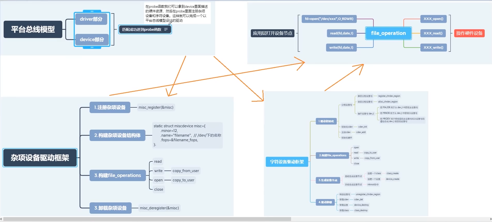

#### 设备树下的platform总线

##### driver.c

```bash
#include <linux/init.h>
#include <linux/module.h>
#include <linux/platform_device.h>
#include <linux/of.h>
#include <linux/of_address.h>

int size;
u32 out_value[2]={0};
const char *str;

struct device_node *test_node;
struct prperty *test_property;
unsigned int *vir_addr;

int beep_probe(struct platform_device *pdev)
{
    int ret;
    printk("beep probe\n");

    //printk("name = %s\n", pdev->dev.of_node->name);

    /*test_node = of_find_node_by_path("/testb");
    if(test_node == NULL)
    {
        printk("find error\n");
        return -1;
    }
    printk("node name success:%s",test_node->name);
    */

    // ret = of_property_read_u32_array(pdev->dev.of_node, "reg", out_value, 2);//test_node
    // if(ret < 0)
    // {
    //     printk("reg error\n");
    //     return -1;
    // }
    // printk("reg out_value[0]:0x%08x",out_value[0]);
    // printk("reg out_value[1]:0x%08x",out_value[1]);

    vir_addr = of_iomap(pdev->dev.of_node, 0);
    if(vir_addr == NULL)
    {
        printk("of_iomap error\n");
        return -1;
    }
    return 0;
}

int beep_remove(struct platform_device *pdev)
{
    printk("beep remove\n");
    return 0;
}

const struct platform_device_id beep_idtable = {
    .name = "beep_test",  // 设备名，必须和注册的设备名一致
};

const struct of_device_id of_match_table_test[]={
    {.compatible = "testc"},
    {}
};

struct platform_driver beep_driver = {
    .probe = beep_probe,
    .remove = beep_remove,
    .driver = {
        .owner = THIS_MODULE,
        .name = "beep_test",
        .of_match_table = of_match_table_test,
        //.name = "123"
    },
    .id_table = &beep_idtable
};

//of_match_table_test > beep_idtable.name >  beep_driver.driver.name

static int beep_driver_init(void)
{
    int ret = 0;

    ret = platform_driver_register(&beep_driver);
    if(ret < 0){
        printk("platform_driver_register error\n");
    }
    return 0;
}

static void beep_driver_exit(void)
{
    printk("device exit\n");
    platform_driver_unregister(&beep_driver);
}

module_init(beep_driver_init);
module_exit(beep_driver_exit);

MODULE_LICENSE("GPL");
```

## pinctrl和gpio子系统

```bash
pinctrl系统提供的功能
* 管理系统中所有的可以控制的pin，在系统初始化的时候，美剧所有可以控制的pin，并标识这些pin
* 管理这些pin的复用(Multiplexing)。对于SOC而言，其引脚除了配置成普通的GPIO之外，若干个引脚还可以组成一个pin group，形成特定的功能。
* 配置这些pin的特性。例如使能或关闭引脚上的pull-up、pull-down电阻，配置引脚的driver strength。
* 不同厂家的pin controller节点里的属性定义
可以通过Linux源码目录/Documentation/devicetree/bindings下的txt文档查看
```
