## 内存通常被划分为代码段、数据段、堆、栈

```bash
代码段通常存放程序的机器指令以及只读常量(如字符串常量、const全局变量)
.text与.rodata常合并为只读段，多个进程可共享以节省内存

数据段用于存储全局变量和静态变量分为
已初始化数据段(.data):存放已赋初值的全局/静态变量
BSS段(.bss):存放未初始化或初始化为0的全局/静态变量，加载时由系统清零

栈(Stack)由编译器自动分配释放，存放函数参数、返回地址、局部变量，遵循LIFO结构，递归过深或分配大数组可能导致栈溢出

堆(Heap)由程序员malloc/free、new/delete等动态分配和释放，适合存储生命周期不确定的大块数据。忘记释放会导致内存泄漏
```
## . ->操作符

```bash
在 C 或 C++ 中，结构体变量的访问有两种主要方式：使用点操作符（`.`）和箭头操作符（`->`）。它们的使用方式取决于你如何引用结构体变量。

1. **使用`.`操作符**：
    - 当你有一个**结构体变量**时，使用点操作符来访问结构体的成员。
    - 例子：
        struct Person {
            int age;
            char name[20];
        };  
        struct Person p;
        p.age = 30;  // 使用点操作符
        
2. **使用`->`操作符**：
    - 当你有一个**结构体指针**时，使用箭头操作符来访问结构体的成员。
    - 例子：
        struct Person {
        int age;
        char name[20];
        };
        struct Person *p = malloc(sizeof(struct Person));
        p->age = 30;  // 使用箭头操作符
总结：
    - 使用 `.` 时，变量是结构体的实例。
    - 使用 `->` 时，变量是结构体的指针。
```

## arm64各变量字节大小

```bash
long    8字节 64位
int     4字节 32位
short   2字节 16位
char    1字节 8位
bool    1字节 8位

```

## 指针和指针变量的区别

```bash
* 指针
	- 本质 内存地址，用于标记数据的实际存储位置
	- 示例 0x7ffeea3b9a4c(某变量的十六进制地址)
	- 存在形式 抽象的逻辑概念(地址值的实际意义)
* 指针变量
	- 本质 一种变量类型，用于存储指针(即地址值)
	- 示例 int* p = &a;(定义了一个名为p的指针变量)
	- 存在形式 具体存在的变量(占据内存空间)
```
```c
//基础使用
int main(){
	int a = 10;
	int* p = &a;
	printf("a 的地址(指针): %p\n",(void*)&a);//输出类似0x7ffeea3b9a4c
	printf("p 存储的地址(指针): %p\n",(void*)a);//输出同上
	printf("a 的值: %d\n",a);//10
	printf("通过p访问的值:%d\n",*p);//*p解引用指针，输出10

	*p = 20;
	printf("修改后a 的值: %d\n",a);//20

	return 0;
}
/*
&a是指针(地址值),它的值类似0x7ffeea3b9a4c
p是指针变量,它的类型是int*,存储的是a的地址
*p通过指针变量访问地址指向的数据
*/
```
```c
//指针变量与指针的显式区别
int main()
{
	int a = 100;
	int b = 200;

	int* p;//p是未初始化的指针变量
	p = &a;//p存储a的地址
	printf("p指向的值:%d\n",*p);//输出100

	p = &b;
	printf("p指向的值:%d\n",*p);//输出200

	return 0;
}

/*指针变量p可以存储不同的指针(地址值),先指向a,后指向b
指针是地址的抽象逻辑(如&a),而指针变量是存储这些地址的可变容器*/
```
```c
//动态内存中的指针变量
int main()
{
	//动态分配内存,malloc返回的指针为0x1a2b3c(假设值)
	int* ptr = (int*) malloc(sizeof(int));

	*ptr = 30;//操作指针变量ptr存储的地址(指针)指向的内存(地址存储的值)
	printf("val:%d\n",*ptr);//输出30

	free(ptr);//释放ptr指向的内存
	ptr = NULL;//重置指针变量,避免野指针

	return 0;
}
/*malloc返回的指针如0x1a2b3c是一个地址值
ptr是指针变量,始终持有该地址(直到被修改或释放)*/
```

```c
//指针变量的类型与操作
int main()
{
	char c = 'A';
	int* p_int = (int*)&c;//强制类型转换(危险操作)

	printf("char的地址(指针):%p\n",(void*)&c);//地址值
	printf("p_int存储的地址值:%p\n",(void*)p_int);//同上

	//*p_int解引用时按int类型解析(可能越界访问)
	printf("解引用p_int的值(错误操作):%d\n",*p_int);
	//结果不可预测

	return 0;
}

/*同一个指针(如&c的地址)可以被不同指针变量存储(例如char* int*),但类型决定了操作方式
类型错误的指针变量解引用可能导致逻辑错误或崩溃*/
```

```bash
总结：
指针(地址值):像街道地址(如北京市海淀区xx路1号),时数据的物理位置标注
指针变量:像记录地址的笔记本(如房产A的地址:北京市海淀区xx路1号),是程序员操作的具象容器,通过类型声明决定访问方式
```

### 指针的大小

```bash
指针变量/指针的大小是固定的（由系统架构决定，32位系统 4字节，64位系统 8字节）

指针所指向的数据类型会影响以下方面
1.指针解引用时访问的字节数
char *ptr;    1字节
int *ptr;     4字节
double *ptr;  8字节
```
```c
int x = 0x12345678;
int* int_ptr = &x;
char* char_ptr = (char*)&x;
printf("%x\n",*int_ptr);  0x12345678
printf("%x\n",*char_ptr); 0x78
```
```bash
2.指针算术运算的步长
指针加减整数n时，实际的偏移量是n*sizeof(指向的数据类型)

char *ptr: ptr + 1    移动1字节
int *ptr: ptr + 1     移动4字节
double *ptr: ptr + 1  移动8字节
```
```c
int arr[3] ={10,20,30};
int* ptr = arr;
printf("%d\n",*(ptr + 1));输出20

char *cptr = (char*)arr;
printf("%d\n".*(cptr + 4));输出20
```
```bash
3.内存对齐(Alignment)
4.类型安全与编译器检查
```
## lsblk和df -h,fdisk -l的区别与应用场景

```bash
lsblk(列出所有块设备)
显示系统中所有块设备（如磁盘、分区和挂载点）的树状结构。它展示了设备的名称、大小、类型和挂载点等信息
举例：
NAME   MAJ:MIN RM  SIZE RO TYPE MOUNTPOINT
sda      8:0    0  500G  0 disk
├─sda1   8:1    0  100G  0 part /
└─sda2   8:2    0  400G  0 part /home
- 查看系统中所有的磁盘和分区，包括大小、类型、挂载点等。
- 适用于查看磁盘分区的结构，特别是当你想要查看磁盘之间的关系和挂载情况时。

df -h(磁盘空间使用情况)
df 显示文件系统的磁盘空间使用情况，-h 选项使输出易于人类阅读（例如使用 GB 或 MB 而不是字节）。它不显示所有的磁盘，而是只显示已经挂载的文件系统的使用情况。
举例：
Filesystem      Size  Used Avail Use% Mounted on
/dev/sda1       100G  30G   70G  30% /
/dev/sda2       400G  200G  200G  50% /home
- 查看已挂载文件系统的使用情况，确定磁盘空间是否快满，哪些分区的空间已被占用。
- 适用于监控系统磁盘使用情况，帮助管理员快速查看磁盘使用比例。

fdisk -l(显示磁盘分区表)
显示系统中所有磁盘的分区表，包括磁盘的大小、分区类型、分区表结构等。它会列出系统所有的物理磁盘及其分区信息，但不会显示文件系统的使用情况。
举例：
Disk /dev/sda: 500 GiB, 500107862016 bytes, 976773168 sectors
Device     Start        End    Sectors   Size Type
/dev/sda1   2048     209919   207872   101M EFI System
/dev/sda2  209920 976773119 976563200 465.9G Linux filesystem
- 查看磁盘的详细分区结构，包括每个分区的起始和结束扇区、大小、类型等。
- 适用于磁盘管理、分区操作（例如，删除、添加分区），以及了解硬盘的底层分区信息。
```

## 指针变量传值

```c
void GetClockBeingStatus(int fd, unsigned int *status)
{
    *status = ReadFpgaReg(fd,TMSYNC_MANIPULATE_OFFSET + GET_LOCAL_CLOCK_STATUS_ADDR_OFFSET);
    //这里需要传入指针变量类型参数，同时在函数内对该地址赋值
    /*如果只使用
    void GetClockBeingStatus(int fd, unsigned int status)
    {
	    status = ReadFpgaReg(fd,TMSYNC_MANIPULATE_OFFSET + GET_LOCAL_CLOCK_STATUS_ADDR_OFFSET);
	    return;
    }
    status变量的值是局部变量无法传出
    */
    return;
}

//主函数调用
GetClockBeingStatus(fd, &status);//传入外部变量的地址
printf("status = %d\n", status);

void GetClockBeingStatus(int fd, unsigned int *status) { *status = ReadFpgaReg(fd,TMSYNC_MANIPULATE_OFFSET + GET_LOCAL_CLOCK_STATUS_ADDR_OFFSET); return; } 
void GetClockBeingStatus(int fd, unsigned int status) { status = ReadFpgaReg(fd,TMSYNC_MANIPULATE_OFFSET + GET_LOCAL_CLOCK_STATUS_ADDR_OFFSET); return; }
有什么区别 
调用使用GetClockBeingStatus(fd, &status);和GetClockBeingStatus(fd, status);
又有什么区别
```
```bash
传递解读
```
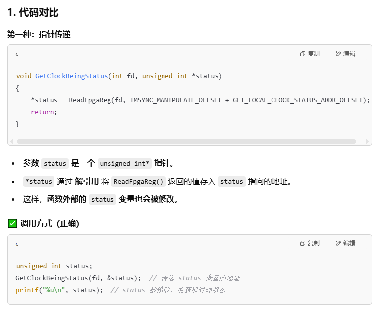
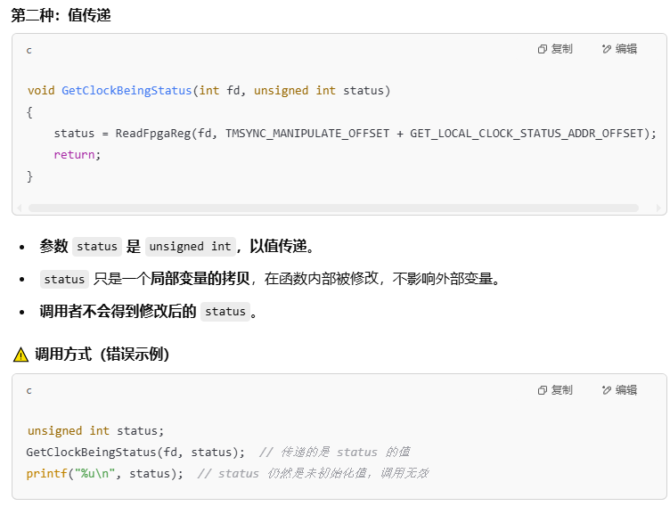
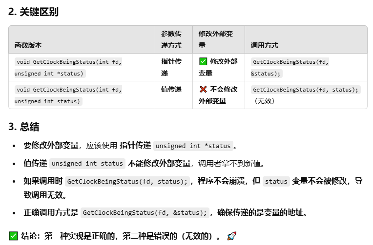
```bash
数组变量传递
```
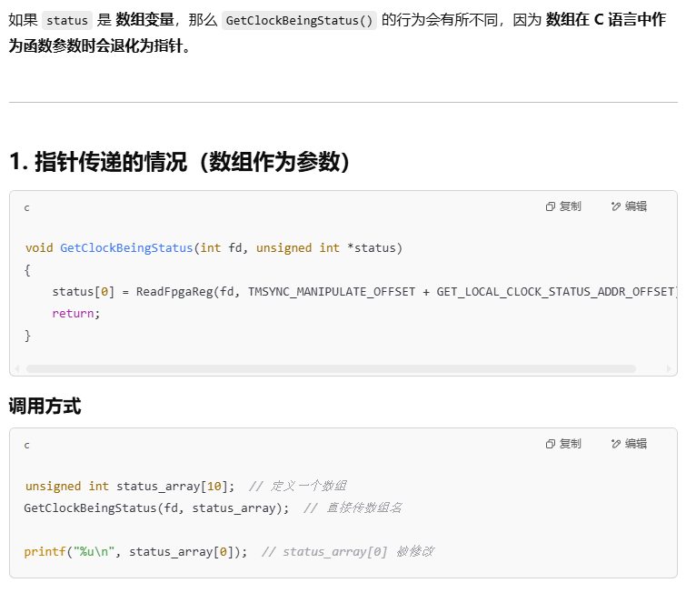
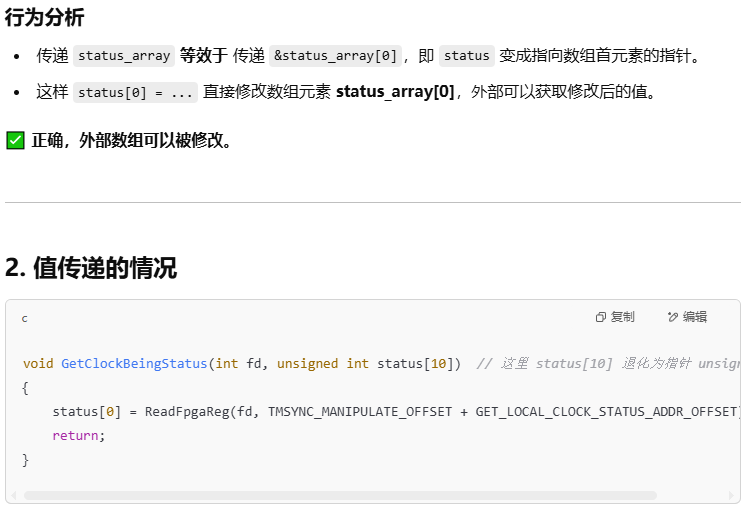
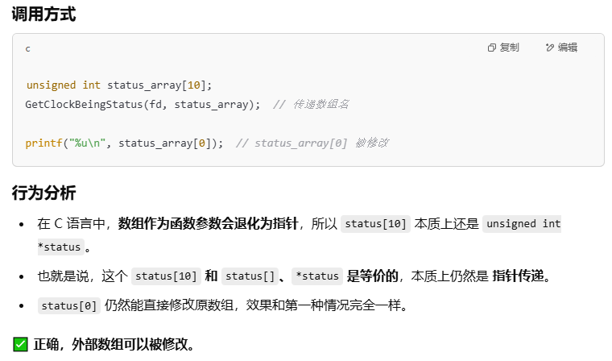
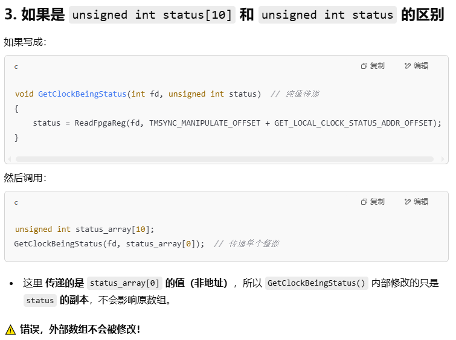
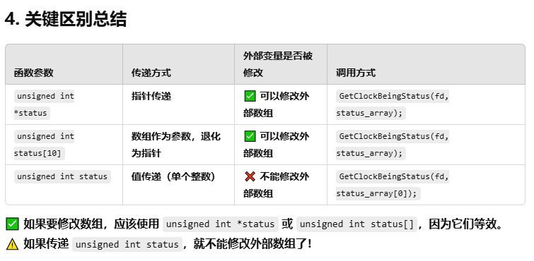

## TFTP

```c
tftp -g -r test.c 192.168.10.100
```

## CAN

```bash
CAN的全称为 Controller Area Network
特点：
1.多主控制，根据标识符ID决定优先级，ID不是表示发送的目的地址，而是表示访问总线的消息的优先级
2.系统柔软性，没有类似地址的信息
3.通信速度快，距离远，最高1Mbps（d < 40m）,最远可10km(speed < 5Kbps)
4.具有错误检测、错误通知和错误恢复功能,所有单元都可以检测错误，检测出错误的单元会立即同时通知其他所有单元，正在发送消息的单元一旦检测出错误，会强制结束当前的发送。强制结束发送到单元会不断反复地重复发送此消息直到发送成功为止。
5.故障封闭功能，CAN可以判断出错误的类型是总线上暂时的数据错误还是持续的数据错误，由此，当总线上发生持续数据错误时，可将引起此故障的单元从总线上隔离出去。
6.连接节点多，可同时连接多个单元的总线。
电气属性
CAN_H，CAN_L
总线电平分为显性电平和隐形电平
显性电平表示逻辑0，此时CAN_H：3.5V，CAN_L:1.5V
隐形电平表示逻辑1，此时CAN_H,CAN_L:2.5V

```
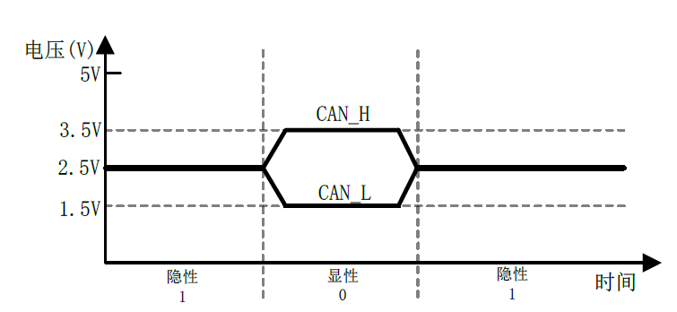
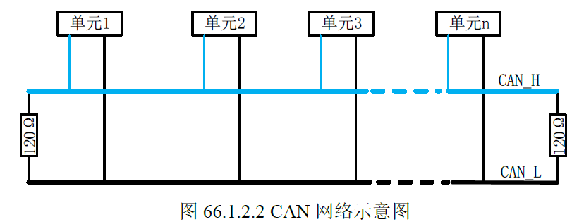
```bash
CAN协议有5种帧格式来传输数据：数据帧，遥控帧，错误帧，过载帧和帧间隔。
其中数据帧和遥控帧有标准格式和扩展格式两种，
标准格式有11位标识符（ID），扩展格式有29个标识符（ID）
帧用途如下：
```

### 数据帧
```bash
数据帧由7段组成
帧起始，表示数据帧开始的段
仲裁段，表示该帧优先级的段
 - 标准格式ID为11位，发送顺序位ID10到ID0，最高7位ID10~ID4不能全为隐性(1),也就是禁止0X1111111XXXX，扩展格式ID为29位，基本ID从ID28到ID18，扩展ID由ID17到ID0，基本ID与标准格式一样，禁止最高7位都为隐性。
控制段，表示数据的字节数及保留位的段
数据段，数据的内容，一帧可发送0~8个字节的数据
 - 从最高位开始发送（MSB）
CRC段，检查帧的传输错误的段
ACK段，表示确认正常接收的段
帧结束，表示数据帧结束的段
 - 由7位隐性位构成
```
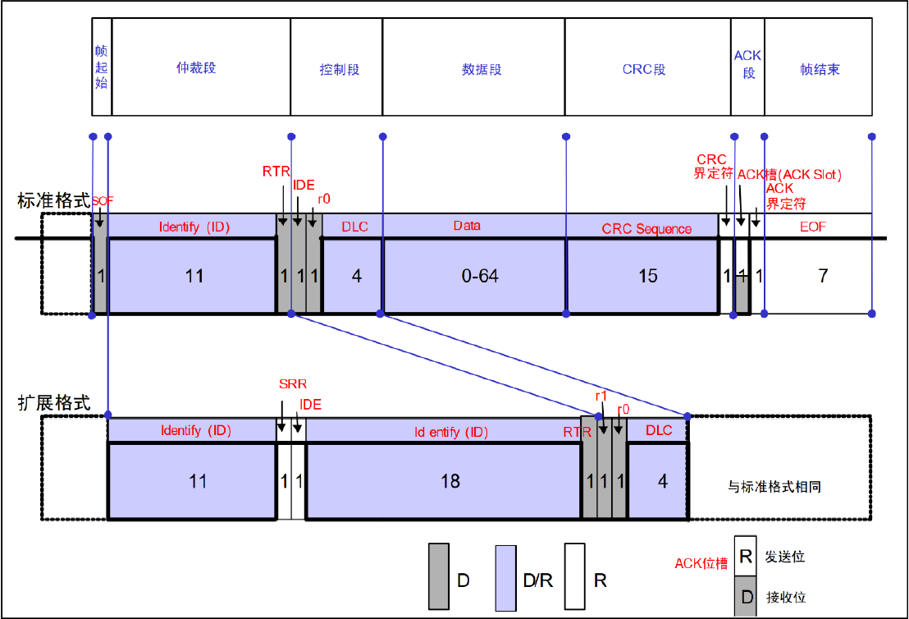
```bash
D表示显性电平0，R表示隐性电平1，D/R表示显性或隐性，也就是0或1
```

```bash
控制段
其中r1和r0为保留位，保留位必须以显性电平发送。DLC为数据长度，高位在前，DLC段有效值范围为0~8
```
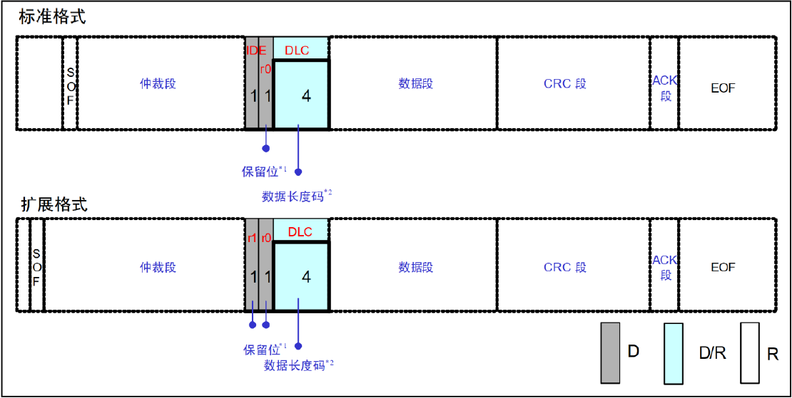
```bash
CRC段
由15位CRC值与1位CRC界定符组成，计算范围包括：帧起始，仲裁段，控制段，数据段
```
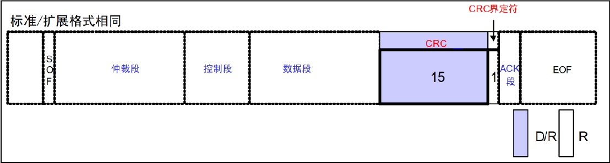
```bash
ACK段
由ACK槽和ACK界定符组成
```
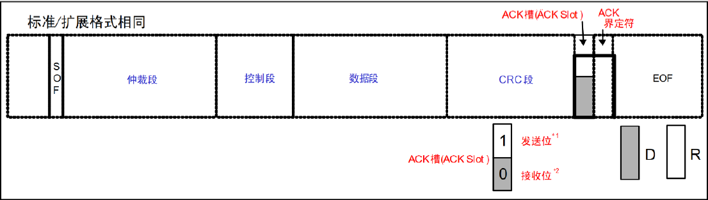

### 遥控帧
```bash
帧起始，表示数据帧开始的段
仲裁段，表示该帧优先级的段
控制段，表示数据的字节数及保留位的段
CRC段，检查帧的传输错误的段
ACK段，表示确认正常接收的段
帧结束，表示数据帧结束的段

遥控帧结构基本和数据帧一样，最主要区别就是遥控帧没有数据段。遥控帧的RTR位为隐性，数据帧的RTR位为显性。DLC表示的是所请求的数据帧数据长度
```
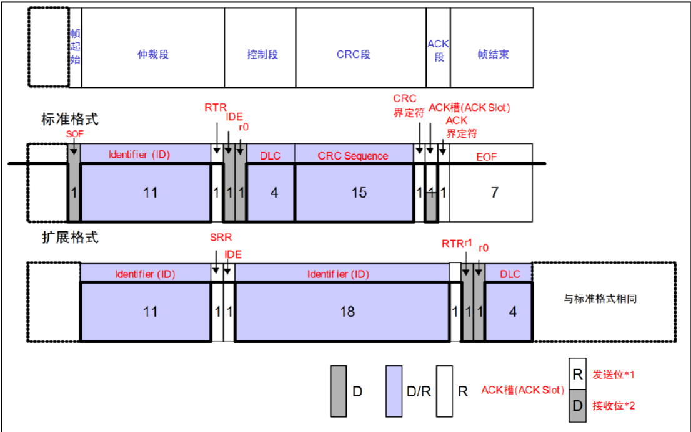

### 错误帧

```bash
错误帧由错误标志和错误界定符两部分组成
错误标志有主动错误标志和被动错误标志两种，主动错误标志是6个显性位，被动错误标
志是6个隐性位，错误界定符由8个隐性位组成。
```
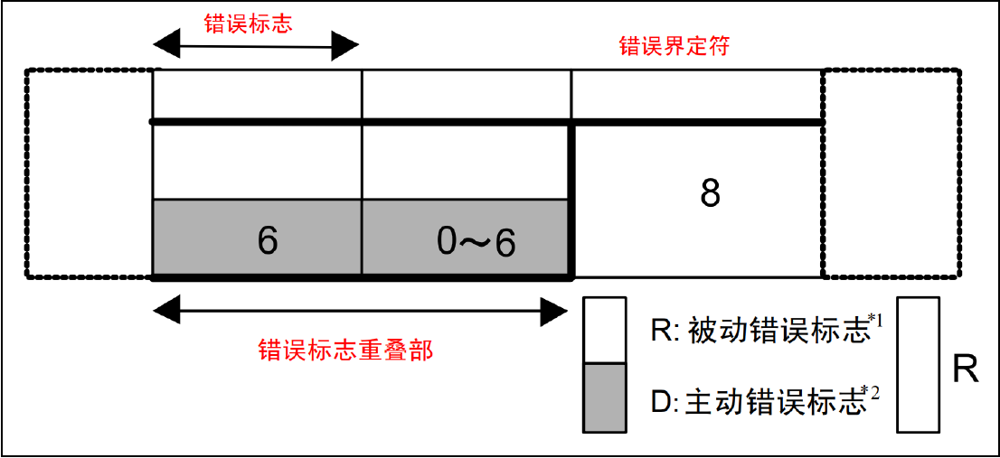

### 过载帧

```bash
接收单元尚未完成接收准备的话就会发送过载帧，过载帧由过载标志和过载界定符构成
过载标志由 6个显性位组成，与主动错误标志相同，过载界定符由 8个隐性位组成，与错
误帧中的错误界定符构成相同。
```
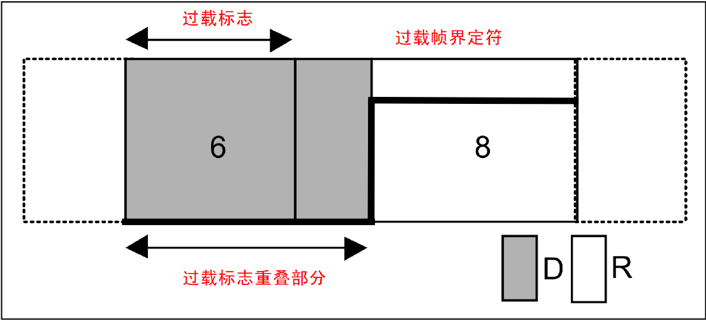

### 帧间隔

```bash
帧间隔用于分隔数据帧和遥控帧，数据帧和遥控帧可以通过插入帧间隔来将本帧与前面的
任何帧隔开，过载帧和错误帧前不能插入帧间隔，帧间隔结构如图

中间隔由3个隐性位构成，总线空闲为隐性电平，长度没有限制，本状态下表示总线空闲，发送单元可以访问总线。延迟发送由8个隐性位构成，处于被动错误状态的单元发送一个消息后的帧间隔中才会有延迟发送。
```
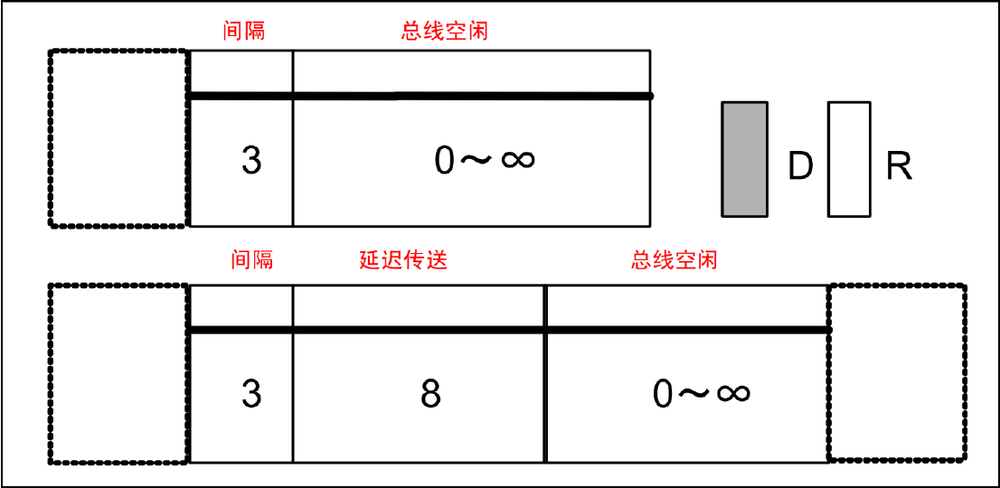

## Makefile

```bash
CXX = g++
CXXFLAGS = -Wall
TARGET = server client

all:$(TARGET)

server: server.cpp
	$(CXX) $(CXXFLAGS) -o $@ $^

client: client.cpp
	$(CXX) $(CXXFLAGS) -o $@ $^

clean:
	rm -f $(TARGET)

CXX = g++
- `CXX` 是一个变量，指定使用的 C++ 编译器
- 这里设为 `g++`，表示使用 GNU C++ 编译器

CXXFLAGS = -Wall
- `CXXFLAGS` 是编译参数的变量
- `-Wall`：开启所有常见的编译警告

TARGET = server client
- 定义了最终要生成的两个目标文件（可执行程序）名字：`server` 和 `client`
- 后续用于 `all` 和 `clean`

all:$(TARGET)
- 这是默认目标（在命令行输入 `make` 就执行这个）
- 它依赖于 `$(TARGETS)`，也就是 `server` 和 `client`
- 表示要编译所有目标

server: server.cpp
	$(CXX) $(CXXFLAGS) -o $@ $^
- `server` 是目标名
- 它依赖 `server.cpp`（当 `.cpp` 修改时会重新编译）
- `$(CXX)`：替换为 `g++`
- `$(CXXFLAGS)`：替换为 `-Wall -O2`
- `-o $@`：`$@` 表示目标名（即 `server`）
- `$^`：表示所有依赖文件（这里就是 `server.cpp`）
g++ -Wall -o server server.cpp

client: client.cpp
	$(CXX) $(CXXFLAGS) -o $@ $^
同理

clean:
	rm -f $(TARGETS)
执行 `make clean` 会执行 `rm -f server client`，清除构建产物。
```

## GDB

```bash
准备阶段
ulimit -c unlimited
sudo sysctl -w kernel.core_pattern="./core.%e.%p.%t"

|参数|含义|示例|
|---|---|---|
|`%e`|**可执行文件名**（不含路径）|`myprogram`|
|`%p`|**进程号（PID）**|`12345`|
|`%t`|**core 文件生成时间戳（UNIX时间）**|`1716052401`|
|`%u`|进程所属用户的 UID|`1000`|
|`%g`|进程所属组的 GID|`1000`|
|`%s`|导致 core dump 的信号编号（如 SIGSEGV=11）|`11`|
|`%h`|主机名|`ubuntu`|
|`%c`|core dump 限制值（从 `RLIMIT_CORE` 获取）|`unlimited` or 0|

core.myprogram.12345.1716052401

编译阶段
gcc -g -o myprogram myprogram.c

调试阶段
gdb -tui ./myprogram core

(gdb) break main              # 在 main 函数处设置断点
(gdb) break myfunction        # 在某个函数入口设置断点
(gdb) break myprogram.c:42    # 在特定文件的第42行设置断点

(gdb) info breakpoints

(gdb) next        # 执行下一行，不进入函数内部（step over）
(gdb) step        # 执行下一行，若是函数则进入函数内部（step into）
(gdb) finish      # 跳出当前函数

(gdb) print x             # 查看变量 x 的值
(gdb) display x           # 每步执行后自动显示 x 的值
(gdb) set var x = 10      # 修改变量的值

(gdb) break myprogram.c:42 if x > 5

(gdb) delete 1        # 删除编号为 1 的断点
(gdb) disable 1       # 禁用断点
(gdb) enable 1        # 启用断点

(gdb) backtrace           # 查看函数调用栈（调试崩溃时很有用）
(gdb) info locals         # 查看当前函数的局部变量
(gdb) info args           # 查看函数参数

(gdb) quit

(gdb) lay next            #源代码+汇编代码+命令窗口
nexti next
(gdb) x/i $pc             #显示**当前即将执行的汇编指令**。
(gdb) info registers      #显示当前 CPU 寄存器的值
```

## vim

```bash

```

## git

### 创建本地库与链接
```bash
git init

## 首先进行仓库关联
git remote add origin https://github.com/yourname/your-repo.git
git remote add origin git@github.com:yourname/your-repo.git

## 如果输错了
git remote set-url origin <新的地址>

github配置ssh

ls ~/.ssh/id_rsa.pub
## 没有则生成
ssh-keygen -t rsa -b 4096 -C "your_email@example.com"
## 复制该内容，登录 GitHub，添加到GitHub > Settings > SSH and GPG keys > New SSH Key
cat ~/.ssh/id_rsa.pub


## 测试是否连通
ssh -T git@github.com
https://git-lfs.com/

## 大文件需要安装git lfs 

## 文件夹下
git lfs install
git lfs track "*.mp4"

git add .gitattributes
git add "（3）演示视频/final.mp4"
git commit -m "Add video using Git LFS"
git push origin master

```
### 常用命令
```bash
git log 查看日志操作

git checkout -b 307 创建分支并进入，但存在会拷贝原分支的数据的情况

git branch 查看分支都有哪些

git status 查看分支状态

git add .

git commit -m "424"

git push -u origin 424

git rm -r interface0522

git commit -m "rm 0522"

git push

git fetch --all 更新分支信息

# 将main分支的所有内容合并到别的分支
# 切换到 main 分支
git checkout main

# 创建一个临时分支备份（可选）
git branch backup_522 522

# 切换到 522 分支
git checkout 522

# 使用 main 的内容强制覆盖当前分支
git reset --hard main

# 强制推送（如果是远程分支）
git push origin 522 --force

#删除本地分支
git branch -d master

#删除远程 `master` 分支
git push origin --delete master

```

## GPIO

### Rockchip的引脚命名转换

```bash
rk3568
#define GPIO_CHIP "/dev/gpiochip2"
#define GPIO_LINE 28  // GPIO2_D4 3*8+4
GPIO编号 = BANK × 32 + GROUP × 8 + n
|字母|编号|
|---|---|
| A | 0 |
| B | 1 |
| C | 2 |
| D | 3 |

rk3588
GPIO编号 = (GPIO组编号 * 32) + 脚位偏移
GPIO_NUM = (GPIOx * 32) + (字母编号 * 8) + y
GPIO1_A0 32*1+0 = 32

貌似是一样的

```

### 标准Linux方式

```bash
GPIO编号 = bank × 32 + pin_index
```

### 举例

```bash
对于 `GPIO1_A6`：

- **标准方式**：A组就是前8个引脚，A6是第6个 → pin_index = 6

- **Rockchip方式**：A=group0, pin=6 → group × 8 + pin = 0 × 8 + 6 = 6

所以最终都是：`bank × 32 + 6`


|GPIO名称|标准计算|Rockchip计算|结果|

|GPIO1_A0|1×32 + 0 = 32|1×32 + 0×8 + 0 = 32
|GPIO1_A6|1×32 + 6 = 38|1×32 + 0×8 + 6 = 38
|GPIO1_B3|1×32 + 11 = 43|1×32 + 1×8 + 3 = 43
|GPIO2_D4|2×32 + 28 = 92|2×32 + 3×8 + 4 = 92

```

### 虚拟机共享文件夹

```bash
/etc/fstab

.host:/    /mnt/hgfs    fuse.vmhgfs-fuse    allow_other,defaults    0    0
```

## 修改连接优先级

```bash
# 查看当前激活的连接
nmcli connection show --active

# 设置eth0连接自动连接并提高优先级
sudo nmcli connection modify "eth0" connection.autoconnect yes
sudo nmcli connection modify "eth0" connection.autoconnect-priority 100

# 降低WiFi连接的自动连接优先级
sudo nmcli connection modify "ym'phone" connection.autoconnect-priority 10

# 重启NetworkManager
sudo systemctl restart NetworkManager
```

# 通用寄存器

```bash
AArch64执行状态支持31个64位的通用寄存器，分别是X0～X30 寄存器，而AArch32状态支持16个32位的通用寄存器。

在AArch64 状态下，使用X（如X0、X30 等）表示64 位通用寄存器。另外，还可以使用W 来表示低32 位的数据，如W0 表示X0 寄存器的低32 位数据，W1 表示X1 寄存器的低32位数据
```

![[Pasted image 20260227131246.png]]

# PSTATE寄存器

![[Pasted image 20260227131325.png]]
![[Pasted image 20260227131333.png]]

# 特殊寄存器

![[Pasted image 20260227131352.png]]

![[Pasted image 20260301170520.png]]

# 异常处理

```bash
异常分为同步异常和异步异常
中断是异步异常的一种；

指令异常和数据异常为同步异常：
- 执行了`SVC`（系统调用）指令（主动触发）。
- 访问内存时发生了缺页（数据中止）。
- 取指令时发生了错误（指令中止）。
- 尝试执行未定义的指令。
- 除零错误（算术异常）。

常见异步异常包括物理中断和虚拟中断
物理中断：SError,IRQ,FIQ
虚拟中断：vSError,vIRQ,vFIQ
```
## 中断

```bash
在ARM64处理器中，中断请求分为普通中断请求(IRQ)和快速中断请求(FIQ,优先级高)
```

![[Pasted image 20260227121646.png]]

## 中止

```bash
主要有指令中止和数据中止
通常是指访问内存地址时发生了错误(如缺页等)，处理器内部的MMU捕获这些错误并且报告给处理器。

指令中止是指当处理器尝试执行某条指令时发生了错误，
数据中止是指使用加载或者存储指令读写外部存储单元时发生了错误。
```

## 复位

```bash
复位操作时优先级最高的一种异常处理。
```

## 系统调用的异常种类

```bash
ARMv8 体系结构提供了 3 种软件产生的异常和 3 种系统调用。系统调用允许软件主动地通过特殊指令请求更高异常等级的程序所提供的服务。

SVC 指令：允许用户态应用程序请求操作系统内核的服务。
HVC 指令：允许客户操作系统（guest OS）请求虚拟机监控器（hypervisor）的服务。
SMC 指令：允许普通世界（normal world）中的程序请求安全监控器（secure monitor）的服务。
```

## 异常等级

```bash
EL0为非特权模式，用于运行应用程序。
EL1为特权模式，用于运行操作系统内核。
EL2用于运行虚拟化管理程序。
EL3用于运行安全世界的管理程序。
```

![[Pasted image 20260227123720.png]]

# 异常入口

# 异常返回

```bash
当操作系统的异常处理完成后，执行一条 ERET 指令即可从异常返回。

对于异步异常，返回地址指向第一条还没执行或由于中断没有成功执行的指令
对于不是系统调用的同步异常，返回地址是触发同步异常的那条指令
对于系统调用的同步异常，返回的是系统调用指令的下一条指令
```

![[Pasted image 20260227145607.png]]

# 栈的选择

![[Pasted image 20260227144720.png]]

```bash
异常发生时，如果 CPU 正在 EL0 中运行用户空间进程，突然触发了一个中断，CPU 就会跳转到 EL1 来处理这个中断，因此 CPU 会自动选择 SP_EL1 指向的栈空间。
```

# 异常处理的执行状态

```bash
HCR_EL2 寄存器中有一个 RW 域（Bit[31]），它记录了异常发生后 EL1 要处在哪个执行状态下。

1 表示在 AArch64 执行状态下。
0 表示在 AArch32 执行状态下。

当异常发生之后执行状态是可以发生改变的。
```

# 异常返回的执行状态

```bash
当异常处理结束之后，调用 ERET 指令返回时要不要切换执行模式呢？这里需要看 SPSR的相关记录。
```

![[Pasted image 20260227151636.png]]

# 异常向量表

```bash
当异常发生时，处理器必须跳转和执行与异常相关的处理指令。异常相关的处理指令通常存储在内存中，这个存储位置称为异常向量。

在 ARMv8 体系结构中，每个异常级别都有自己的向量表，即 EL3、EL2 和EL1 各有一个异常向量表。
ARMv8 的异常向量表发生了变化，每一个表项是 128 字节，这样可以存放 32 条指
令。注意，ARMv8 指令集支持 64 位指令集，但是每一条指令的位宽是 32 位，而不是 64 位。

除 EL0 之外，每个 EL 都有自己的异常向量表。
异常向量表的基地址需要设置到 VBAR_ELx 中。
异常向量表的起始地址必须以2 KB 字节对齐。
每个表项可以存放 32 条指令，一共 128 字节。
```

![[Pasted image 20260227152428.png]]
![[Pasted image 20260227152436.png]]

# VBAR_ELx

```bash
ARMv8 体系结构提供了一个 VBAR_ELx 寄存器来设置异常向量表的地址。其中 Bit[63:11]存放异常向量表，而Bit[10:0]是保留的，异常向量表的基地址就需要与2 KB 地址对齐了。
```

![[Pasted image 20260227172502.png]]
# 异常现场

```bash
在异常发生时需要保存发生异常的现场，以免破坏了异常发生前正在处理的数据和程序状态。

我们需要在栈空间里保存如下内容：
PSTATE 寄存器的值
PC值
SP值
X0~X30寄存器的值

这个栈空间指的是发生异常时进程的内核态的栈空间。在操作系统中，每个进程都有一个内核态的栈空间
```

# 同步异常的解析

```bash
有一个与访问失效相关的寄存器——异常综合信息寄存器(Exception Syndrome Register,ESR)
```

![[Pasted image 20260301165548.png]]


# 中断

```bash
又想中断处理程序运行的快，又想中断处理程序完成的工作量多，这两个目的显然有所抵触。

注册中断处理程序request_irq(irq_msi(分配的中断号), pcie_xdma_read_req_handler(实际中断处理程序), IRQF_SHARED(位掩码，该标志表明可以在多个中断处理程序之间共享中断线，在同一个给定线上注册的每个处理程序必须指定这个标志；否则在每条线上只能由一个处理程序), "my_pcie_irq"(中断相关的设备的ASCII文本表示), pdev(共享中断线，dev将提供唯一的标志信息，以便于从共享中断线的诸多中断处理程序中删除指定的那一个));
```

## 中断上半部

```bash
接收到一个中断，他就立即开始执行，但只做有严格时限的工作。例如对接收的中断进行应答或硬件复位。这些工作都是在所有中断被禁止的情况下完成的
```

## 中断下半部

```bash
下半部是一个操作系统通用词汇，用于指代中断处理流程中推后执行的那一部分

能够被允许稍后完成的工作会推迟到下半部。在合适的时机，下半部会被开中断执行。

如果一个任务对时间非常敏感，将其放在中断处理程序中执行
如果一个任务和硬件相关，将其放在中断处理程序中执行
如果一个任务要保证不被其他中断(特别是相同的中断)打断，将其放在中断处理程序中执行
其他所有任务，考虑放置在下半部执行
```

## 工作推后执行机制

![[Pasted image 20260302133832.png]]

### 软中断

```bash
软中断是在编译期间静态分配的。softirq_action结构体
软中断保留给系统中对时间要求最严格以及最重要的下半部使用，目前只有两个子系统(网络和SCSI)直接使用软中断

定义在<linux/interrupt.h>
struct softirq_action {
	void (*action)(struct softirq_action *);
}

在kernel/softirq.c中定义了一个包含有32个该结构体的数组

static struct softirq_action softirq_vec[NR_SOFTIRQS];

每个被注册的软中断都占据该数组的一项，因此最多可能有32个软中断。这是一个定值，注册的软中断数目的最大值没法动态改变，目前版本的内核中，只用到了9个。

```

#### 执行软中断时机

```bash
从一个硬件中断代码处返回时
在ksoftirqd 内核线程中
在那些显式检查和执行待处理的软中断的代码中，如网络子系统中

不管是用什么办法唤起，软中断都要在do_softirq()中执行。
```

![[Pasted image 20260302154958.png]]

### tasklet

```bash
tasklet是利用软中断实现的一种下半部机制。
```

### 工作队列

